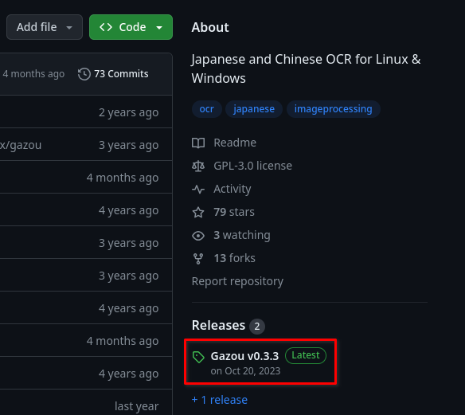
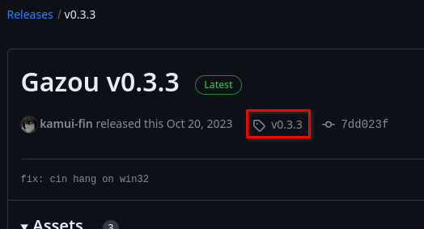
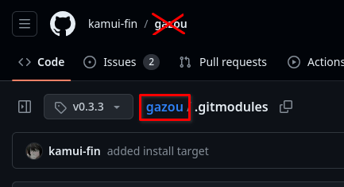
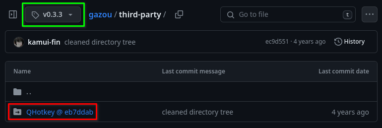
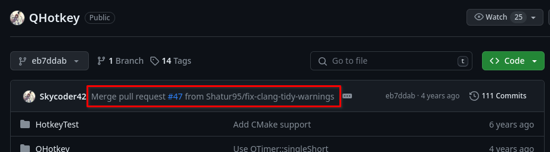
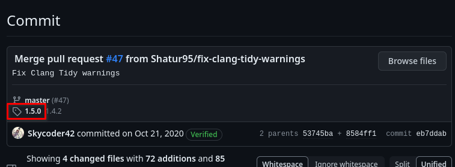
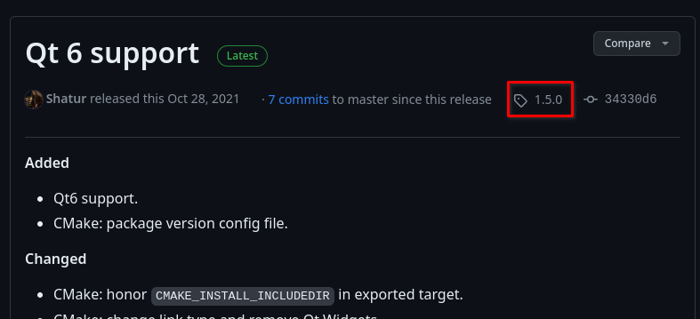
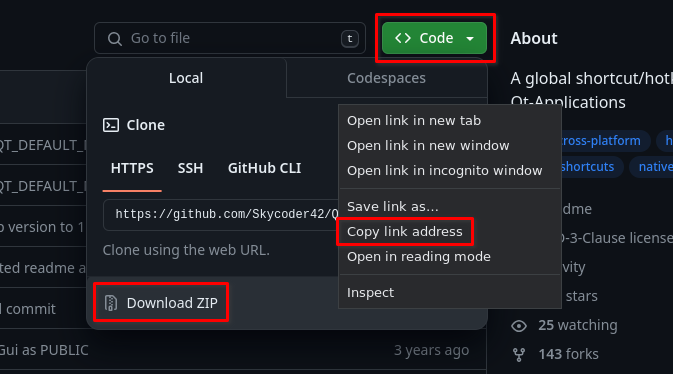

# How to fetch git submodules?
Some git repos use [git
submodules](https://git-scm.com/book/en/v2/Git-Tools-Submodules) to download
dependencies. They require special attention when making `xbps-src` templates.

<!-- toc -->

## Should the dependency be a submodule?
`xbps-src` should handle all dependencies if possible. If the project depends on
a git submodule that is already packaged in `void-packages` and you are sure
that breakage won't occur, you should replace the submodule with actual packaged
dependency.

If you choose this path, you will likely have to [patch the build
system](../xbps-src-tutorial/packaging-j4-dmenu-desktop.md#when-their-build-system-is-broken)
or modify it in some other way to accept the packaged dependency. If you are
knowledgable of git submodules and upstream's build system, you could propose a
more packaging friendly way to handle dependencies [to
upstream](../troubleshooting.md#notifying-upstream).

But if the project is using a old version of the submodule or a customized one,
this likely won't be possible. The submodule also might not be packaged.

Header only libraries also [don't really meet the quality
requirements](../xbps-src-tutorial/packaging-j4-dmenu-desktop.md#quality-requirements) (but it
depends), so packaging them as a dependency might not be reasonable. Leaving the
header only dependency as a git submodule is preferable in this scenario.

## Release archives
This tutorial assumes that the submodule isn't included in the release archive.
GitHub doesn't include submodules in default release archives and upstream
developers usually don't care to add a proper release archive with all
submodules included. This is the "correct" way to make release archives.

When submodules are included in a release archive, you don't have to worry about
submodules because they're already there.

## Downloading
The proper official way to handle submodules is to add their archive to
`distfiles`. But you must the version of the submodule that is used in the
packaged release.

## Hunting for submodule archives
I will be showing this off on the
[`gazou`](https://github.com/void-linux/void-packages/blob/3ddc63b10ff4f7a574996a3a43952c39c732101f/srcpkgs/gazou/template)
package.

I will show off two ways to figure out the submodule source archive. One is
[using GitHub UI](#using-github-ui) on a project which uses GitHub Releases. The
second method is [using plain `git`](#using-git).

### Using GitHub UI
Go to the release the package is using (here it's the latest release `v0.3.3`):



Click on the associated tag:



This will take you back to the repository in the state it was when the release
was made.

You should look at the `.gitmodules` file to see where are the git submodules
located. `gazou`'s `.gitmodules` looks like this:
```
[submodule "third-party/QHotkey"]
	path = third-party/QHotkey
	url = https://github.com/Skycoder42/QHotkey.git
```

`gazou` has a single submodule in `third-party/QHotkey`.

You should return to the root of the repository. You must click on the correct link:



If you click on the link crossed out on the picture, you will return to master
and you will no longer be browsing the repo at the specified commit.

You should go to the directories where the submodules should be:



You should also make sure that you are still checked out to the release. The
green box shouldn't contain `master` nor `main`. It should be a tag.

Click on the submodule. You will be taken to the submodule in the commit it was
pinned to when the release of the template you're packaging (here `gazou`) was
made.

The URL will now contain the commit hash:

```
https://github.com/Skycoder42/QHotkey/tree/eb7ddaba57b108f99c2fefcd4eb23cef9c0ed681
```

This hash is usable, but you should make sure that the commit isn't tied to a
tag. Tags should be preferred over commit hashes because they are nicer and
shorted. To do that, click on the top commit:



You should see whether there is a tag listed:



If it isn't (it is on the picture), return to the root of the repo while
preserving the checkout like before and proceed with [getting the
archive](#getting-the-archive).

Click on the tag. If you get brought to a release page, click on the tag again:



#### Getting the archive
Click on "Code" and copy the link for downloading ZIP:



This is the link to download the submodule. Note that `void-packages` prefers
`.tar.gz` archives instead of `.zip` archives. GitHub has no button for that,
but you can simply change the link:

```
https://github.com/Skycoder42/QHotkey/archive/refs/tags/1.5.0.zip
```

```
https://github.com/Skycoder42/QHotkey/archive/refs/tags/1.5.0.tar.gz
```

This is the resulting archive. It might contain the commit hash if the submodule
is pointing to a untagged commit.

You can now proceed with [adding distfiles](#add-distfiles).

### Using git
Go tho the root of the repository and get a git link. On GitHub, you can simply
append `.git` to the URL to get a HTTPS link for cloning the repo. You can also
use the green "Code" button. Other hosting services might require a different
process to get the git link.

You should look up the release tag of the project. You can then clone the repo
like this.

```
git clone --depth 1 --single-branch --branch <tag> <repo>
```

This is faster than a full clone.

You should check what submodules does the repo need. They are defined in
`.gitmodules` in the root of the repository:
```
> cat .gitmodules
[submodule "third-party/QHotkey"]
	path = third-party/QHotkey
	url = https://github.com/Skycoder42/QHotkey.git
```

In this example, a single submodule must be downloaded. You can download it with
```
git submodule update --init
```

You can specify a path of the submodule if there are several and you only need a
subset of them.

When you `cd` into the directory the module resides in (here it's
`third-party/QHotkey`), `git show` will show you whether the commit pinned by
the submodule is associated with a tag:

```
commit eb7ddaba57b108f99c2fefcd4eb23cef9c0ed681 (HEAD, tag: 1.4.2)
Merge: 53745ba 8584ff1
Author: Felix Barz <Skycoder42@users.noreply.github.com>
Date:   Wed Oct 21 07:10:48 2020 +0200

    Merge pull request #47 from Shatur95/fix-clang-tidy-warnings

    Fix Clang Tidy warnings
```

Here it is. It's in tag `1.4.2`. It might not be in your package. Your program
could even have several git submodules with tagged and untagged commits mixed.

If the submodule is pinned to a tag, you should use a tag instead of a commit.

You now have to construct the archive link. The following instructions are valid
for GitHub only, you will have to adjust it if the package isn't hosted on
GitHub.

Tagged archive link looks like this:
```
https://github.com/<repo owner>/<repo name>/archive/refs/tags/<TAG>.tar.gz
```

Untagged archive link looks like this:
```
https://github.com/<repo owner>/<repo name>/archive/<COMMIT>.tar.gz
```

For `QHotkey` it looks like this:
```
https://github.com/Skycoder42/QHotkey/archive/refs/tags/1.5.0.tar.gz
```
```
https://github.com/Skycoder42/QHotkey/archive/eb7ddaba57b108f99c2fefcd4eb23cef9c0ed681.tar.gz
```

## Adding the submodule to `distfiles` { #add-distfiles }
Now you should have a link to an archive that will contain the submodule. You
can add it to `distfiles`, but the rule about `${version}` in `distfile` links
applies for submodule distfiles too. You can't use `version` because that's the
main package version, not the version of the submodule. You will have to define
custom variables for versions of the submodules.

The variables should start with an underscore and they should be named after the
name of the project the submodule wants to pull.

[`gazou`](https://github.com/void-linux/void-packages/blob/3ddc63b10ff4f7a574996a3a43952c39c732101f/srcpkgs/gazou/template)
pulls `QHotkey`, so the variable is `_qhotkey_version`. The `_version` suffix
shouldn't really be there, but it's acceptable. `_qhotkey` is also a good name
for the variable.

It should contain either the tag or the commit hash of the submodule.

You should then use this variable in `distfiles` like you would use `${version}`
in a normal distfile.

## Extracting the submodule
The submodule has to be extracted into a specific location. You have to handle
that. There are several ways to do that, none of which is superior to the
others. I will show off one way to do it.

### Skip extraction and extract manually
Templates can specify a `skip_extraction` extraction variable. It should contain
a list of archives downloaded in `distfiles` which shouldn't be automatically
extracted. "This must match the basename of any url defined in `${distfiles}`"
says the `Manual`.

Setting this allows us to extract the archive manually into our desired location
and it simplifies `wrksrc`[^wrksrc].

You can use the `vsrcextract` helper to extract the archive.

Here's how
[`gazou`](https://github.com/void-linux/void-packages/blob/3ddc63b10ff4f7a574996a3a43952c39c732101f/srcpkgs/gazou/template)
does it:
```bash
# Template file for 'gazou'
pkgname=gazou
version=0.3.3
revision=1
_qhotkey_version=eb7ddaba57b108f99c2fefcd4eb23cef9c0ed681
build_style=cmake
configure_args="-DGUI=ON"
hostmakedepends="pkg-config qt5-qmake qt5-host-tools"
makedepends="qt5-devel tesseract-ocr-devel leptonica-devel qt5-x11extras-devel"
short_desc="Japanese and Chinese OCR application"
maintainer="jaminW55 <jaminW55@proton.me>"
license="GPL-3.0-only"
homepage="https://github.com/kamui-fin/gazou"
distfiles="https://github.com/kamui-fin/gazou/archive/refs/tags/v${version}.tar.gz
 https://github.com/Skycoder42/QHotkey/archive/${_qhotkey_version}.tar.gz"
checksum="b939ebfaca7fa5703025328c5cb670e8718aaeace11eaadcbde506b0eb6c04e2
 2dc72c4c7c23ae2e721fdde7605829f7735e004ac235632855101216cc94d926"

skip_extraction="${_qhotkey_version}.tar.gz"

post_extract() {
	vsrcextract -C third-party/QHotkey "${_qhotkey_version}.tar.gz"
}
```

A commit hash is used here. As I've shown above, a tag should be used instead
because `QHotkey` is pinned to a tagged version in `gazou`. _I,
[meator](https://github.com/meator), may or may not be the creator of this
template and this mistake may or may not be my fault._

Here you can see that the submodule is specified as the second distfile, it has
an appropriate checksum, it's using `_qhotkey_version` and it isn't hardcoding
the version in `distfiles`, `skip_extraction` is used and `vsrcextract` is used
to extract the submodule archive to the correct place.

## Another example
Another good example of using git submodules in templates is
[`grpc`](https://github.com/void-linux/void-packages/blob/3ddc63b10ff4f7a574996a3a43952c39c732101f/srcpkgs/grpc/template).
It uses the special `{URL}>{name}` syntax [described in
Manual](https://github.com/void-linux/void-packages/blob/master/Manual.md#optional-variables)
to change the name of the downloaded archive. They are then put into
`skip_extraction` and extracted in `post_extract`.

[^wrksrc]: When there are multiple distfiles in a template, they are extracted
           into the builddir and `wrksrc` is set to the builddir and not to a
           specific distfile's directory. This can be annoying to work with.
           `build_wrksrc` can be used to tell `xbps-src` which of the extracted
           directories should be treated as the primary one. [CWD is set to
           `build_wrksrc` in some build
           steps.](../xbps-src-tutorial/packaging-j4-dmenu-desktop.md#cwd)
