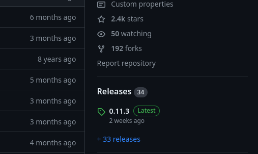

# Package update tutorial

**This tutorial is up to date as of March 4, 2024**

This tutorial will guide you through updating an already existing package using
`xbps-src`.

### Prerequisites
- basic knowledge of Git
- basic knowledge of GitHub for contributing (have an account, know how to make
  a pull request)
- basics of CLI

```admonish warning
This tutorial described the simple procedure of changing the `version` and
`checksum` of a template. Some updates have breaking changes that have to be
accounted for. There is no universal way to fix it, you have to figure it out.

If a simple `version` update won't cut it, you'll have to make changes to the
template. You can read the [xbps-src packaging
tutorial](xbps-src-packaging-tutorial.md) for an in-depth explanation of
templates.

This tutorial is aimed at simpler packages. You likely won't be able to update
browsers, kernels, DEs and other stuff without a great amount of work.
```

---

<!-- toc -->

## Make sure that a PR isn't open already
You should look in <https://github.com/void-linux/void-packages/pulls> and make
sure that an open PR doesn't already make the changes you want. If there is one,
you should follow [PR testing tutorial](pr-testing-tutorial.md).

## Setting up `void-packages` and the masterdir
_Skip this section if you have everything set up._

The procedure differs depending on whether you want to contribute your changes
to [`void-packages`](https://github.com/void-linux/void-packages) or not.

If you do not want to contribute the update and you don't plan to use
[`void-packages`](https://github.com/void-linux/void-packages) in the future,
you can clone the repo with
```sh
git clone --depth 1 https://github.com/void-linux/void-packages.git
```

Cloning with `--depth 1` is much faster, but it doesn't include history, which
is necessary for updating the repo and it's useful for contributing.

If you want to use
[`void-packages`](https://github.com/void-linux/void-packages) in the future,
you should do a full clone (`void-packages`'
[CONTRIBUTING](https://github.com/void-linux/void-packages/blob/master/CONTRIBUTING.md#creating-updating-and-modifying-packages-in-void-by-yourself)
recommends using SSH):
```sh
git clone git@github.com:void-linux/void-packages.git
# Or this with HTTPS if you do not want to set up SSH keys:
#git clone https://github.com/void-linux/void-packages.git
```

A full clone takes about 15 minutes on my computer and it occupies 626M[^clone].

If you want to contribute, you should have a fork of
[`void-packages`](https://github.com/void-linux/void-packages) set up. You should then clone it:
```sh
# Replace with your fork!vvvvvv
git clone git@github.com:meator/void-packages.git
# Or this with HTTPS if you do not want to set up SSH keys:
# Also replace with your fork!vvvvvv
#git clone https://github.com/meator/void-packages.git
```

You should also set up the `upstream` remote[^remotes]:
```sh
git remote add upstream git@github.com:void-linux/void-packages.git
# Or this with HTTPS if you do not want to set up SSH keys:
#git remote add upstream https://github.com/void-linux/void-packages.git
```

After cloning it, you must set up a masterdir. This can be done with the
following command (after you `cd` into the repository):

```sh
./xbps-src binary-bootstrap
```

This takes about two minutes on my notebook.

You can now build packages in
[`void-packages`](https://github.com/void-linux/void-packages) using

```
./xbps-src pkg <package>
```

You can install built packages with
```
sudo xi -f <package>
```

(The `xi` utility is provided by the `xtools` package.)

## Setting up a branch
_You can skip this if you are making the update for personal use only. But
having it in a separate branch is still useful for organisation._

Making pull requests from `master` of your fork is discouraged. You should set
up a branch for your update. I will be updating `khal`, so I will create a
branch named `khal`:

```
git checkout -b khal upstream/master
```

## Updating package
I will be demonstrating the process on the `khal` package. You should do this on
the package you want to update, the process is the same.

`khal`'s template at the time of writing this tutorial looks like this:

```bash
# Template file for 'khal'
pkgname=khal
version=0.11.2
revision=2
build_style=python3-module
_rundeps="python3-click python3-click-log python3-configobj python3-dateutil
 python3-icalendar python3-pytz python3-tzlocal python3-urwid python3-xdg
 python3-atomicwrites"
hostmakedepends="python3-setuptools_scm python3-Sphinx python3-sphinxcontrib $_rundeps"
depends="$_rundeps"
checkdepends="python3-pytest python3-freezegun python3-hypothesis vdirsyncer $depends"
short_desc="Command-line calendar build around CalDAV"
maintainer="Anachron <gith@cron.world>"
license="MIT"
homepage="http://lostpackets.de/khal/"
changelog="https://raw.githubusercontent.com/pimutils/khal/master/CHANGELOG.rst"
distfiles="${PYPI_SITE}/k/khal/khal-${version}.tar.gz"
checksum=8fb8d89371e53e2235953a0765e41b97e174848a688d63768477576d03f899ba
make_check=ci-skip # some tests fail when running as root

post_install() {
	vlicense COPYING

	local _pypath="${DESTDIR}/${py3_sitelib}"
	if [ "$CROSS_BUILD" ]; then
		_pypath="${_pypath}:${XBPS_CROSS_BASE}/${py3_lib}"
	fi

	for sh in bash fish zsh; do
		PYTHONPATH="${_pypath}" _KHAL_COMPLETE="${sh}_source" \
			"${DESTDIR}/usr/bin/khal" > "khal.${sh}"
		vcompletion "khal.${sh}" $sh
	done

	vsconf khal.conf.sample

	PYTHONPATH="${_pypath}" make -C doc man
	vman doc/build/man/khal.1
}
```

The template uses version `0.11.2`. There is a newer version `0.11.3`:


We first have to modify the `version` variable to match version `0.11.3`:
```bash
# Template file for 'khal'
pkgname=khal
version=0.11.3
revision=2
build_style=python3-module
_rundeps="python3-click python3-click-log python3-configobj python3-dateutil
 python3-icalendar python3-pytz python3-tzlocal python3-urwid python3-xdg
 python3-atomicwrites"
hostmakedepends="python3-setuptools_scm python3-Sphinx python3-sphinxcontrib $_rundeps"
depends="$_rundeps"
checkdepends="python3-pytest python3-freezegun python3-hypothesis vdirsyncer $depends"
short_desc="Command-line calendar build around CalDAV"
maintainer="Anachron <gith@cron.world>"
license="MIT"
homepage="http://lostpackets.de/khal/"
changelog="https://raw.githubusercontent.com/pimutils/khal/master/CHANGELOG.rst"
distfiles="${PYPI_SITE}/k/khal/khal-${version}.tar.gz"
checksum=8fb8d89371e53e2235953a0765e41b97e174848a688d63768477576d03f899ba
make_check=ci-skip # some tests fail when running as root

post_install() {
	vlicense COPYING

	local _pypath="${DESTDIR}/${py3_sitelib}"
	if [ "$CROSS_BUILD" ]; then
		_pypath="${_pypath}:${XBPS_CROSS_BASE}/${py3_lib}"
	fi

	for sh in bash fish zsh; do
		PYTHONPATH="${_pypath}" _KHAL_COMPLETE="${sh}_source" \
			"${DESTDIR}/usr/bin/khal" > "khal.${sh}"
		vcompletion "khal.${sh}" $sh
	done

	vsconf khal.conf.sample

	PYTHONPATH="${_pypath}" make -C doc man
	vman doc/build/man/khal.1
}
```

A new version of a package should have `revision` always set to 1:
```bash
# Template file for 'khal'
pkgname=khal
version=0.11.3
revision=1
build_style=python3-module
_rundeps="python3-click python3-click-log python3-configobj python3-dateutil
 python3-icalendar python3-pytz python3-tzlocal python3-urwid python3-xdg
 python3-atomicwrites"
hostmakedepends="python3-setuptools_scm python3-Sphinx python3-sphinxcontrib $_rundeps"
depends="$_rundeps"
checkdepends="python3-pytest python3-freezegun python3-hypothesis vdirsyncer $depends"
short_desc="Command-line calendar build around CalDAV"
maintainer="Anachron <gith@cron.world>"
license="MIT"
homepage="http://lostpackets.de/khal/"
changelog="https://raw.githubusercontent.com/pimutils/khal/master/CHANGELOG.rst"
distfiles="${PYPI_SITE}/k/khal/khal-${version}.tar.gz"
checksum=8fb8d89371e53e2235953a0765e41b97e174848a688d63768477576d03f899ba
make_check=ci-skip # some tests fail when running as root

post_install() {
	vlicense COPYING

	local _pypath="${DESTDIR}/${py3_sitelib}"
	if [ "$CROSS_BUILD" ]; then
		_pypath="${_pypath}:${XBPS_CROSS_BASE}/${py3_lib}"
	fi

	for sh in bash fish zsh; do
		PYTHONPATH="${_pypath}" _KHAL_COMPLETE="${sh}_source" \
			"${DESTDIR}/usr/bin/khal" > "khal.${sh}"
		vcompletion "khal.${sh}" $sh
	done

	vsconf khal.conf.sample

	PYTHONPATH="${_pypath}" make -C doc man
	vman doc/build/man/khal.1
}
```

The package won't build now because the source archive has changed. `xbps-src`
checksums the source archive. Because it has changed, the check will fail.

The `xtools` package includes a handy helper for calculating the checksums:
`xgensum`. You just have to run:

```
xgensum -i khal
```

and it will automatically download the archive and generate the sha256sum. The
`-i` flag will modify the template in place and it will overwrite the `checksum`
variable.

Note that `xgensum` will output this:
```
=> xbps-src: updating software in / masterdir...
=> xbps-src: cleaning up / masterdir...
=> khal-0.11.3_1: running do-fetch hook: 00-distfiles ...
=> WARNING: khal-0.11.3_1: wrong checksum found for khal-0.11.3.tar.gz - purging
/host/sources/khal-0.11.3/khal-0.11.3.tar.gz
=> khal-0.11.3_1: fetching distfile 'khal-0.11.3.tar.gz' from 'https://files.pythonhosted.org/packages/source/k/khal/khal-0.11.3.tar.gz'...
khal-0.11.3.tar.gz: [192KB 2%] 49KB/s ETA: 00m00s
khal-0.11.3.tar.gz: 192KB [avg rate: 2361KB/s]
=> khal-0.11.3_1: verifying checksum for distfile 'khal-0.11.3.tar.gz'...
=> ERROR: SHA256 mismatch for 'khal-0.11.3.tar.gz:'
a8ccbcc43fc1dbbc464e53f7f1d99cf15832be43a67f38700e535d99d9c1325e
=> ERROR: khal-0.11.3_1: couldn't verify distfiles, exiting...
```

The last three lines are highlighted red. You don't have to worry about the
`ERROR`, this is the intended behaviour of `xgensum`.

The package should be usable now. You can now build it with
```
./xbps-src pkg khal
```

If it doesn't build, there is a possibility that there has been a breaking
change in the update (I am speaking generally, `khal` specifically should
build). This is a possibility that I've mentioned at the beginning of this page.
You should check the release notes in the GitHub Releases page or a changelog if
the project has one.

It might be necessary to modify the template to fix the build. There is no
universal way to fix these problems, but general understanding of `xbps-src` is
helpful in these situations. I recommend you reading the [xbps-src packaging
tutorial](xbps-src-tutorial/index.md).

## `xlint`
You should always run `xlint` when finishing a package. It can find common
errors in templates and it enforces some stylistic choices used across
[`void-packages`](https://github.com/void-linux/void-packages).

A package update should ideally not change `xlint` output.
```
xlint khal
```
should output nothing.

It it does output warnings, you should fix them. But if the template is
complicated and the warning did occur before you have made the changes (you
haven't caused the warnings), it is tolerable to leave the warning be. You
should make a comment about it in the pull request description.

## Making a pull request
Contributing is described at [Contributing](xbps-src-tutorial/contributing.md). You should already
have a working clone of your fork, the `upstream` remote should be set up and
you should be on a non-default branch. You can skip these parts in
[Contributing](xbps-src-tutorial/contributing.md).

[You should ensure that the branch is up to date.](troubleshooting.md#being-up-to-date)

To summarize, the process should look like this:

First
```
xbump khal
```

This will create the commit. It should look something like this:
```diff
> git show
commit c2728f03ff3db70bbd575143ae1801ca40fb2314
Author: meator <meator.dev@gmail.com>
Date:   Sun Feb 25 12:00:00 2024 +0100

    khal: update to 0.11.3.

diff --git a/srcpkgs/khal/template b/srcpkgs/khal/template
index d43a04bef73..f56d78ad9ff 100644
--- a/srcpkgs/khal/template
+++ b/srcpkgs/khal/template
@@ -1,7 +1,7 @@
 # Template file for 'khal'
 pkgname=khal
-version=0.11.2
-revision=2
+version=0.11.3
+revision=1
 build_style=python3-module
 _rundeps="python3-click python3-click-log python3-configobj python3-dateutil
  python3-icalendar python3-pytz python3-tzlocal python3-urwid python3-xdg
@@ -15,7 +15,7 @@ license="MIT"
 homepage="http://lostpackets.de/khal/"
 changelog="https://raw.githubusercontent.com/pimutils/khal/master/CHANGELOG.rst"
 distfiles="${PYPI_SITE}/k/khal/khal-${version}.tar.gz"
-checksum=8fb8d89371e53e2235953a0765e41b97e174848a688d63768477576d03f899ba
+checksum=a8ccbcc43fc1dbbc464e53f7f1d99cf15832be43a67f38700e535d99d9c1325e
 make_check=ci-skip # some tests fail when running as root

 post_install() {
```

Then you should push the changes:
```sh
# replace khal with your branch name
git push -u origin khal
```

It will output a link that will open the pull request.

---

[^clone]: There are alternative ways of cloning. They are described at
          [different ways of cloning](tips_and_tricks.md#different-ways-of-cloning).
[^remotes]: This is briefly described in the [remotes section of contributing
            (of this tutorial, not void-packages'
            CONTRIBUTING)](xbps-src-tutorial/contributing.md#remotes)
