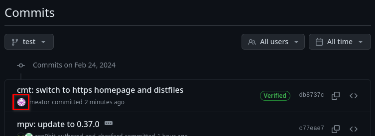
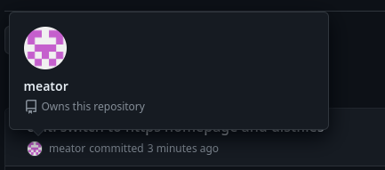
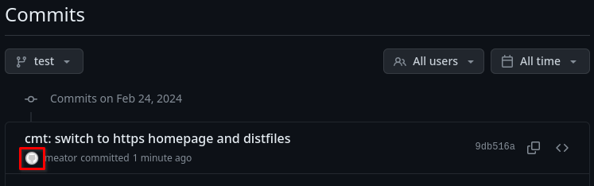
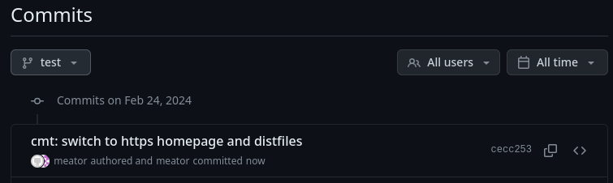
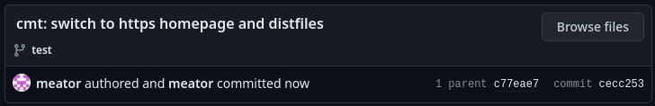
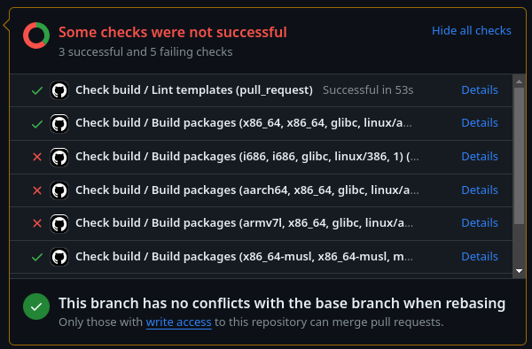

# Contributing

Let's pretend that `bat` nor `oniguruma` are packaged and you want to contribute
them.

<!-- toc -->

## Proper setup
```admonish
If you've been following the [xbps-src packaging tutorial](index.html), you will
have `void-packages` already set up in a certain way. I provide instructions on
how to fix the setup in [a later section](#contributing-bat-and-oniguruma).
```

You should have a GitHub account and know how to use it (this is one of the
prerequisites of this tutorial).

All the setup necessary is described in the [Creating, updating, and modifying
packages in Void by yourself section of
CONTRIBUTING](https://github.com/void-linux/void-packages/blob/master/CONTRIBUTING.md#creating-updating-and-modifying-packages-in-void-by-yourself).
You should read it.

If you have followed the tutorial (namely [Packaging
j4-dmenu-desktop](j4-dmenu-desktop.md)), you should already have a
`void-packages` clone. If that is the case, you don't have to clone it again,
you just have to change the remotes. This is hinted at [below](#remotes).

Cloning with HTTPS should theoretically also work. Setting up SSH can be
cumbersome. But I myself had problems with HTTPS in the past and SSH is the
officially recommended method in CONTRIBUTING.

### Remotes
You should have a working fork now. I will use `meator/void-packages` here, you
should replace it with your own.

You should have two remotes: `origin` and `upstream`. This is how it should look
like for SSH git clone:
```
> git remote -v
origin	git@github.com:meator/void-packages.git (fetch)
origin	git@github.com:meator/void-packages.git (push)
upstream	git@github.com:void-linux/void-packages.git (fetch)
upstream	git@github.com:void-linux/void-packages.git (push)
```
This is how HTTPS looks like:
```
> git remote -v
origin	https://github.com/meator/void-packages.git (fetch)
origin	https://github.com/meator/void-packages.git (push)
upstream	https://github.com/void-linux/void-packages.git (fetch)
upstream	https://github.com/void-linux/void-packages.git (push)
```

If that isn't the case, you can use `git remote add`
```
git remote add upstream git@github.com:void-linux/void-packages.git
```
or
```
git remote add upstream https://github.com/void-linux/void-packages.git
```

See [`git-remote(1)`](https://man.voidlinux.org/git-remote) for more info.

### Linking commits to GitHub account
As mentioned in the linked document, you should [have your commits linked to
your GitHub
account](https://docs.github.com/en/account-and-profile/setting-up-and-managing-your-personal-account-on-github/managing-email-preferences/setting-your-commit-email-address?platform=linux).

This is what a good commit looks like:



When you'll hover over it, you'll see a popup:



This is how a bad commit looks like:



When you hover over it, nothing happens.

Here are some funny examples of bad commits:





Here I have collaborated with myself apparently. This can happen when your
author string doesn't match your `user.name` and `user.email`.

## Things to check
[You should ensure that the repo is up to
date.](../troubleshooting.md#being-up-to-date)

You should also make sure that no `xlint` errors are in the templates you want
to contribute.

It is little late for that now, but you should make sure your package is
following [quality requirements](#quality-requirements).

## Setting up a branch
You shouldn't commit your changes to `master`. To quote from
[CONTRIBUTING](https://github.com/void-linux/void-packages/blob/master/CONTRIBUTING.md#creating-updating-and-modifying-packages-in-void-by-yourself):

> Using the `master` branch of your fork for contributing is also strongly
  discouraged. It can cause many issues with updating your pull request (also
  called a PR), and having multiple PRs open at once. To create a new branch:
> ```
> $ git checkout master -b <a-descriptive-name>
> ```

I create my branches with
```
git checkout upstream/master -b <a-descriptive-name>
```

to really make sure the branch is [up to
date](../troubleshooting.md#being-up-to-date).[^uptodate]

## Making the commits
The most important requirement (apart from quality requirements) are commit
message formats. You can read about them
[here](https://github.com/void-linux/void-packages/blob/master/CONTRIBUTING.md#committing-your-changes).
To quote from it:

> - for new packages, use `New package: <pkgname>-<version>`
> - for package updates, use `<pkgname>: update to <version>.`
> - for template modifications without a version change, use `<pkgname>: <reason>`
> - for package removals, use `<pkgname>: remove package` and include the removal reason in the commit body
> - for changes to any other file, use `<filename>: <reason>`
>
> If you want to describe your changes in more detail, explain in the commit
body (separated from the first line with a blank line).
>
> `xbump`, available in the [`xtools`](https://github.com/leahneukirchen/xtools)
package, can be used to commit a new or updated package:
> ```
> $ xbump <pkgname> [git commit options]
> ```

The `xbump` utility is really useful. You should use it to commit new packages
or to make updates because it will automatically add the relevant files to the
index and it will choose the right commit message.

### Commit strategy
Each commit should be complete. If your pull request contains one commit to
increase the version, one to change the `checksum` and one to adopt the package,
it won't get accepted. You will be asked to put all these changes into a single
commit.

Each commit should be tied to a package. A single commit can't update two
separate packages for example.[^singlecommit]

See [applying fixes to pull requests](#applying-fixes-to-pull-requests) for
methods of enforcing this.

## Making the pull request
You will have to fill out the pull request template. At the time of writing this
tutorial, it looks like this:
```markdown
<!-- Uncomment relevant sections and delete options which are not applicable -->

#### Testing the changes
- I tested the changes in this PR: **YES**|**briefly**|**NO**

<!--
#### New package
- This new package conforms to the [package requirements](https://github.com/void-linux/void-packages/blob/master/CONTRIBUTING.md#package-requirements): **YES**|**NO**
-->

<!-- Note: If the build is likely to take more than 2 hours, please add ci skip tag as described in
https://github.com/void-linux/void-packages/blob/master/CONTRIBUTING.md#continuous-integration
and test at least one native build and, if supported, at least one cross build.
Ignore this section if this PR is not skipping CI.
-->
<!--
#### Local build testing
- I built this PR locally for my native architecture, (ARCH-LIBC)
- I built this PR locally for these architectures (if supported. mark crossbuilds):
  - aarch64-musl
  - armv7l
  - armv6l-musl
-->
```

You should uncomment the `### New package` section of it (assuming that you are
contributing a new package).

Note that you do not have to fill out the Local build testing section if you
didn't add [ci
skip](https://github.com/void-linux/void-packages/blob/master/CONTRIBUTING.md#continuous-integration).

By leaving PR testing to `**YES**|**briefly**|**NO**` instead of picking one of
these, you will show the maintainers that you put little care into making the
PR.

### Patience
Now you have submitted the pull request. The only thing left to do is wait. It
might be reviewed by other people or by Void maintainers.

## Solving check errors
Pull requests are checked using GitHub Actions. They try to build the package
using different architectures and libcs.

Here is an example of a failed check:



You can click on Details to see what `xbps-src` outputted. [It is also useful to
reproduce the error locally.](../tips-and-tricks.md#reproduce-checks-locally)

You should try to fix these errors. Cross compilation is the source of most
problems when contributing new packages. This is briefly described in [Packaging
j4-dmenu-desktop](j4-dmenu-desktop.md) in
[this](j4-dmenu-desktop.md#when-their-build-system-is-broken) and
[this](j4-dmenu-desktop.md#patches) section.

You should also make sure whether you have correctly divided dependencies to
`hostmakedepends` and `makedepends`. If a dependency is in the wrong category,
it is likely the cause of the failed check.

Some tips: The `pkg-config`, `gettext`, `libtool` and `automake` packages should
usually be in `hostmakedepends` and not in `makedepends`. If you are building a
Qt5 program, it usually requires `qt5-qmake` and `qt5-host-tools` in
`hostmakedepends`.

## Applying fixes to pull requests
As mentioned above, commits should be complete and they should target a single
package. This means that you can't just add a fixup commit, you will have to
modify the original commit and add the fix to it. This is described in
[CONTRIBUTING](https://github.com/void-linux/void-packages/blob/master/CONTRIBUTING.md#review).

To summarize it, you can use

```
git commit --amend
```

to add staged changes into the latest commit without creating a new one.

There's also an alternative more advanced method for editing history: `git
rebase -i`.  Explaining it is beyond the scope of this tutorial and it can be
difficult to understand for beginners, but it is a very useful tool for
manipulating git history.

## Contributing `bat` and `oniguruma`
_Do not actually contribute `bat` and `oniguruma`! They are already packaged._

Your repo should look something like this if you have been following [Packaging
bat](bat.md) and [Packaging oniguruma](oniguruma.md):
```git
> git status
On branch bat
[...]

Changes not staged for commit:
  (use "git add/rm <file>..." to update what will be committed)
  (use "git restore <file>..." to discard changes in working directory)
	modified:   common/shlibs
	deleted:    srcpkgs/bat/patches/downgrade-git2.patch
	modified:   srcpkgs/bat/template
	modified:   srcpkgs/oniguruma/template

no changes added to commit (use "git add" and/or "git commit -a")
```

You should be doing this on a separate branch and not on `master`. I'm using
branch `bat` here.

```admonish
It might not look like that if you have been following this tutorial completely.
If that is the case, you'll have to follow these instructions (expand them):
```

~~~admonish info title="Instructions" collapsible=true
```sh
# If your git remote -v looks like this:
## origin	git@github.com:void-linux/void-packages.git (fetch)
## origin	git@github.com:void-linux/void-packages.git (push)
# or like this:
## origin	https://github.com/void-linux/void-packages.git (fetch)
## origin	https://github.com/void-linux/void-packages.git (push)
# proceed with the following instructions:

# git sets the official repo as the master by default. But our origin is
# actually our fork, not the official repo.
git remote rename origin master
# replace this with your own fork!   vvvvvvvvvvvvvvvvvvvvvvvv
git remote add origin git@github.com:meator/void-packages.git
# Use this for HTTPS (you should again use your own fork)
# git remote add origin https://github.com/meator/void-packages.git

# If you aren't on a custom branch, proceed with the following instructions:

# Make sure we're up to date
git fetch upstream
git stash
# Make a new branch and switch to it.
git checkout -b bat upstream/master
git stash pop
```
~~~

~~~admonish info
I will showcase preparing `bat` and `oniguruma` for pull request. Because they
are already packaged, we'll have to cheat a little and pretend that we have just
made them. We'll first make a commit that removes the original packages. _You
won't have to do this when packaging a "real" package._

```
tar -cf files.tar srcpkgs/oniguruma* srcpkgs/bat common/shlibs
git restore .
git rm -r srcpkgs/oniguruma* srcpkgs/bat
sed -i /oniguruma/d common/shlibs
git add common/shlibs
git commit -m "DONOTMERGE"
tar -xf files.tar
rm files.tar
```
~~~

The repo should look like this now (this is the state in which a new package
should be in the beginning):
```
> git status
On branch bat
[...]

Changes not staged for commit:
  (use "git add <file>..." to update what will be committed)
  (use "git restore <file>..." to discard changes in working directory)
	modified:   common/shlibs

Untracked files:
  (use "git add <file>..." to include in what will be committed)
	srcpkgs/bat/
	srcpkgs/oniguruma-devel
	srcpkgs/oniguruma-doc
	srcpkgs/oniguruma/

no changes added to commit (use "git add" and/or "git commit -a")
```

We first commit `oniguruma`:
```
xbump oniguruma
```

`xbump` automatically detects the `oniguruma-devel` and `oniguruma-doc`
subpackages and it detects the shlib change. It also prefills the commit message
with `New package: oniguruma-6.9.9`. The commit looks something like
this:

```
> git show --stat
commit 6ddb847fcd3c60735eb5a7f7d7eb2df1e50baa1a (HEAD -> bat)
Author: meator <meator.dev@gmail.com>
Date:   Sun Feb 25 12:00:00 2024 +0100

    New package: oniguruma-6.9.9

 common/shlibs              |  1 +
 srcpkgs/oniguruma-devel    |  1 +
 srcpkgs/oniguruma-doc      |  1 +
 srcpkgs/oniguruma/template | 35 +++++++++++++++++++++++++++++++++++
 4 files changed, 38 insertions(+)
```

Then we commit `bat`:
```
xbump oniguruma
```

The final commits for the PR look like this:
```
> git log HEAD~2..HEAD --stat
commit 37717d95706c299f77c153b31cc4915b253104dd (HEAD -> bat)
Author: meator <meator.dev@gmail.com>
Date:   Sun Feb 25 12:00:00 2024 +0100

    New package: bat-0.24.0

 srcpkgs/bat/template | 24 ++++++++++++++++++++++++
 1 file changed, 24 insertions(+)

commit 6ddb847fcd3c60735eb5a7f7d7eb2df1e50baa1a
Author: meator <meator.dev@gmail.com>
Date:   Sun Feb 25 12:00:00 2024 +0100

    New package: oniguruma-6.9.9

 common/shlibs              |  1 +
 srcpkgs/oniguruma-devel    |  1 +
 srcpkgs/oniguruma-doc      |  1 +
 srcpkgs/oniguruma/template | 35 +++++++++++++++++++++++++++++++++++
 4 files changed, 38 insertions(+)
```

You can now push these changes to your fork:
```
> git push -u origin bat
Enumerating objects: 25, done.
Counting objects: 100% (25/25), done.
Delta compression using up to 4 threads
Compressing objects: 100% (15/15), done.
Writing objects: 100% (17/17), 3.03 KiB | 3.03 MiB/s, done.
Total 17 (delta 12), reused 0 (delta 0), pack-reused 0
remote: Resolving deltas: 100% (12/12), completed with 6 local objects.
remote:
remote: Create a pull request for 'bat' on GitHub by visiting:
remote:      <A link will appear here.>
remote:
To github.com:meator/void-packages.git
 * [new branch]              bat -> bat
branch 'bat' set up to track 'origin/bat'.
```

You can then follow the link provided by git to create the pull request.

## That's all folks!
This is the end of xbps-src packaging tutorial. Thank you for taking the time to
read this tutorial! Feel free to share your [feedback](../feedback.md) if you'd
like to.

If you want to continue reading, you can look at
[troubleshooting](../troubleshooting.md) and [tips and
tricks](../tips-and-tricks.md) for more useful info about `xbps-src`.

---

[^uptodate]: Using this won't guarantee that the branch is up to date!
[^singlecommit]: Like all rules, this rule has exceptions where such behaviour
                 is acceptable. But this commit separation should be preferred.
