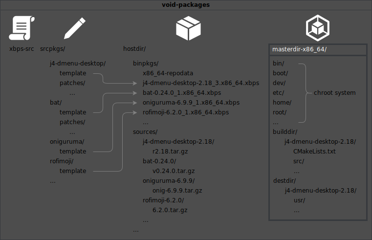
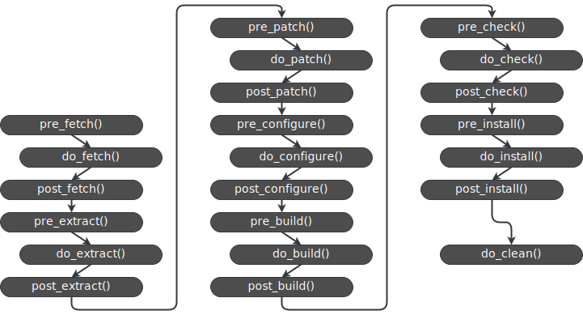

# Packaging j4-dmenu-desktop
<!-- toc -->

```admonish attention
This section of the xbps-src packaging tutorial focuses on packaging
j4-dmenu-desktop version **r2.18**. This version was the latest released version
when this tutorial was written, but it has since been superseded by release
**r3.0**, which addresses many of the issues discussed in this tutorial.

As described in the [introduction of this
tutorial](index.md#obsolescence-of-this-tutorial), specific packages discussed
in this tutorial may be out of date by the time you are reading this. But the
choice to package version r2.18 is deliberate here. This version showcases
many useful features of xbps-src that help with fixing upstream packages.
```

You've heard about a cool program called
[j4-dmenu-desktop](https://github.com/enkore/j4-dmenu-desktop), a desktop menu
that uses `dmenu` and you want to try it out. To do so, you have to:

1. download it,
2. build it and
3. install it

You read their README and come up with the following process to do this:

```sh
{{#include ../../data/j4_build_instructions.txt}}
```

All is well, everything works. But this approach has some disadvantages.

### Why do we care about package management?
`sudo make install` can do a lot of things. It can install the executable to the
system (that's why we're running it), it can install some libraries needed for
`j4-dmenu-desktop`, it can install configuration files, documentation, shell
completions, examples, etc. All these files are just installed to the system and
you have to keep track of them.

Why do you have to keep track of them? Let's say that you have tried
`j4-dmenu-desktop` out and you weren't satisfied with its features, so you want
to uninstall it. You will have to `sudo rm` each file that has been installed.
If you don't care much about a clean uninstall, you might choose to just `rm`
the executable. The rest of `j4-dmenu-desktop`'s files will just sit there. They
will still be installed, but unused. This can waste your storage if, for example,
`j4-dmenu-desktop` includes a large pregenerated documentation collection like
some programs do.

But let's say you've been diligent and you know which files to remove. Still,
wandering around with `sudo rm` in your system directories isn't the best idea.
One typo, one poorly thought-out glob and you've bricked your system.

Let's consider another scenario. You've tried `j4-dmenu-desktop` and you were
awestruck by its features, so you didn't even think about uninstalling it. But
a new version has been released. You don't hesitate and clone the newer version
and redo the download, build, and install process above.

But the new version doesn't install the same set of files to the system as
the older one. There could be some files added and some files missing. This
means that you will also have to keep track of these. You should also remove the
files that were in the older version but are no longer in the new version. These
files will not be overridden by the new install, so they will again just sit
there.

If you are a more knowledgeable Linux user, you could set up a separate destdir
for `j4-dmenu-desktop`. You will have to add it to `$PATH` and potentially handle
shared libraries. This is cumbersome.

Let's say that you were so amazed by `j4-dmenu-desktop` that you rushed to tell
your friends and colleagues about it. They naturally want to try it out too. But
the program could be big, it could take hours to build and its build system
could be complicated and involved. All these problems are avoidable because
your friends only need the executables (and shared libraries + possibly some
supplementary data files like `/etc/` config). You already have all of this, you
just need to send it to them. They don't need the code.

This means that you (again) have to know which files are installed by
`j4-dmenu-desktop` to know what to send _and_ they will also have to keep track
of it for the same reasons you have to.

But they have managed to install it with your provided build. But there's a
small problem: it doesn't run! It's missing dependencies. But which ones? No one
knows.

_If only there was a better way..._

### The better way
This is why we have package management. Each package _owns_ its files and keeps
track of them. This means that completely removing a package is as simple as
running

```sh
sudo xbps-remove j4-dmenu-desktop
```

Because the package _owns_ its files, it can verify their state. Let's say that
you have modified some `j4-dmenu-desktop` files by accident. If you have noticed
it, you can uninstall it and reinstall it. However, you might not have even
noticed.

The package manager can check the state of the package and it can print all
filenames which do not match the package. This is done with `xbps-pkgdb`. It can
also detect missing files.

You can see which files a package provides with `xbps-query -f`:
```sh
> xbps-query -Rf j4-dmenu-desktop
/usr/bin/j4-dmenu-desktop
/usr/share/man/man1/j4-dmenu-desktop.1
```

Another very important aspect of package management that I have partly
overlooked until now is dependencies. Each package maintains a list of its
dependencies. You can query then with `xbps-query -x`:
```sh
> xbps-query -Rx j4-dmenu-desktop
libstdc++>=4.4.0_1
libgcc>=4.4.0_1
glibc>=2.32_1
```

You can't[^youcan] install a package without its dependencies, so breakage cannot
occur.

## What is a package, anyway?
_You don't necessarily have to know the internals of XBPS to be able to package,
but it's interesting to know nonetheless. Feel free to skip this section._

An XBPS package is a file usually ending with `.xbps`. They are managed by the
`xbps-*` utilities, mainly `xbps-install`. Packages are downloaded to
`/var/cache/xbps`.

Packages are signed and checksumed to prevent tampering and to verify
authenticity. The signature is usually contained in a file with the same name as
the package with `.sig` or the newer `.sig2` added to the end of the filename.

A `.xbps` file (like most other "complicated" file formats) is just a disguised
archive. At the time of writing this tutorial, mainly tar zstd archives are
used, but [XBPS supports many
formats](https://github.com/void-linux/xbps/blob/master/README.md#xbps). You can
simply `tar -xf /var/cache/xbps/j4-dmenu-desktop-2.18_3.x86_64.xbps` (if you
have it downloaded).

For example, `j4-dmenu-desktop`'s package looks like this:
```
.
├── files.plist
├── props.plist
└── usr
    ├── bin
    │   └── j4-dmenu-desktop
    └── share
        └── man
            └── man1
                └── j4-dmenu-desktop.1
```

`files.plist` contains the list of files in a package and `props.plist` contains
package metadata (version, homepage...). They are both in
[plist](https://en.wikipedia.org/wiki/Property_list) format, which is derived
from XML.

If you want to examine individual files of a package, you don't have to extract them.
You can use
```
xbps-query -R --cat /usr/share/man/man1/j4-dmenu-desktop.1 j4-dmenu-desktop
```

The archive can include additional special files like `INSTALL` and `REMOVE`. I
won't cover them, read the
[Manual](https://github.com/void-linux/void-packages/blob/master/Manual.md#install_remove_files)
for more info.

A collection of packages is a repository. Official repositories are described
[here](https://docs.voidlinux.org/xbps/repositories/index.html).

A repository is characterized by its `repodata` file. It is named
`<architecture>-repodata`. Repodata files are saved to `/var/db/xbps/` locally.
They contain metadata for all packages in the repository.

They are (again) tar zstd archives. They contain two files: `index.plist` and
`index-meta.plist`. `index-meta.plist` contains the public key. `index.plist`
contains metadata of all packages in the repository.

Repodata is managed by `xbps-rindex`.

## Before we begin...
### Quality requirements
_This section is primarily intended for people who want to contribute their
packages to
[void-packages](https://github.com/void-linux/void-packages). If you want to use
your package yourself and don't want to publish them, you can ignore this
section._

Before I even begin describing `xbps-src`, I have to mention quality
requirements. Not all packages get accepted. All new packages must fulfill the
**package requirements**.

Package requirements can be found in
[the package requirements section of
CONTRIBUTING](https://github.com/void-linux/void-packages/blob/master/CONTRIBUTING.md#package-requirements).

Namely, **<span style="color:red"><ins>software without a release or tag</ins></span>,
cryptocurrency packages, browser forks, simple shell scripts, themes, prebuilt
packages**, and more won't likely get accepted. I recommend you read the
requirements in full linked above.

### Has it been packaged already?
You should check whether it has been packaged already, if a [pull request
providing the package is already
open](https://github.com/void-linux/void-packages/pulls), or if [someone has
already packaged it but it was rejected or
abandoned](https://github.com/void-linux/void-packages/pulls?q=is%3Apr+is%3Aclosed).
If there already is a pull request but it has been abandoned, you base your
package off of it, which will save you time.

## xbps-src
Now, we really begin.

First, you need to clone the
[`void-packages`](https://github.com/void-linux/void-packages) repository.
[`CONTRIBUTING`](https://github.com/void-linux/void-packages/blob/master/CONTRIBUTING.md#creating-updating-and-modifying-packages-in-void-by-yourself)
recommends using SSH. [This needs to be set up for it to
work.](https://docs.github.com/en/authentication/connecting-to-github-with-ssh)
If you have SSH set up, you can clone the repo with:

```
git clone git@github.com:void-linux/void-packages.git
```

If you do not want to set up SSH keys, you can clone with HTTPS:

```
git clone https://github.com/void-linux/void-packages.git
```

The git repository contains everything needed to build an XBPS package[^deps] and
a collection of templates for packages in the official repositories.

If you have experience with other package managers, I should note that
[void-packages](https://github.com/void-linux/void-packages) keep all package
templates in one repository (it isn't one repo per package like the AUR for
example).

The repo is pretty big because of this. There are also 189 334 commits of
history at the time of writing. That's a lot of commits.

At the time of writing this tutorial, cloning the repo took me 15 minutes on my
notebook. It had 626 MB.

[There are faster ways to clone, but this way should be
preferred.](../tips-and-tricks.md#different-ways-of-cloning)

While you wait for it to clone, you can learn more about
[void-packages](https://github.com/void-linux/void-packages):

### void-packages structure
This is the [directory
hierarchy](https://github.com/void-linux/void-packages/blob/master/README.md#directory-hierarchy)
of [void-packages](https://github.com/void-linux/void-packages):
```
 /void-packages
    |- xbps-src
    |- common
    |- etc
    |- srcpkgs
    |  |- <PACKAGE NAME>
    |     |- template
    |
    |- hostdir
    |  |- binpkgs ...
    |  |- ccache ...
    |  |- distcc-<arch> ...
    |  |- repocache ...
    |  |- sources ...
    |
    |- masterdir-<arch>
    |  |- builddir -> ...
    |  |- destdir -> ...
    |  |- host -> bind mounted from <hostdir>
    |  |- void-packages -> bind mounted from <void-packages>
```

Here is a more graphic and simplified version of it showing `j4-dmenu-desktop`,
`bat`, `oniguruma` and `rofimoji` packages:


The most important is `xbps-src`. It is a Bash script which uses XBPS to
build and package programs.

The `srcpkgs` directory contains all _templates_ used by `xbps-src` to build
packages. Templates contain metadata of a package and instructions for building
it.

The `hostdir` directory has two main purposes: it stores the source archives (or
other files that have to be downloaded for the package to build) and it stores
the built `.xbps` packages.

Source archives are stored in `hostdir/sources/<package name>-<version>/`. It is
influenced by the `distfiles` variable ([this is explained later](#distfiles)).

The resulting `.xbps` packages will end up in `hostdir/binpkgs` or
`hostdir/binpkgs/<branch>` if you are on a custom git branch (not on `master`).

But the most important directory is `masterdir-<arch>` (I will from now on
assume that your computer is x86_64 and refer to this directory as
`masterdir-x86_64` like on the diagram above[^uname]). The package is built within
it. It is isolated from the rest of the computer. It contains a small Void Linux
install suitable for chrooting (no kernel included, no firmware included, no
user utilities). It has the `base-chroot` base package[^basechroot] installed
(normal Void Linux systems have `base-system` installed).

The source of the package will be extracted (or put by other means) to
`masterdir-x86_64/builddir/<package name>-<version>/` and it will install the
built executable and supplementary files to
`masterdir-x86_64/builddir/destdir/<package name>-<version>` as if it was
installing to `/`. This is called **"fake destdir"** and it is supported by most
major build systems. For instance, if a program would be normally installed to
`/usr/bin/j4-dmenu-desktop`, it will be installed to
`builddir/destdir/j4-dmenu-desktop-2.18/usr/bin/j4-dmenu-desktop` instead
(relative to `masterdir-x86_64/`).

`xbps-src` requires the installed files to be in the masterdir to know which
files belong to the package.

This is a lot of information. The best way to take it all in is by practising
writing templates. But first, we need to know how to build a package:

### Basic usage of xbps-src
To build packages, a masterdir must be installed. You can bootstrap the
masterdir with this command:
```
./xbps-src binary-bootstrap
```

This installs a minimal version of Void Linux to `masterdir-x86_64`. This takes
about two minutes on my notebook.

You can then build packages in
[void-packages](https://github.com/void-linux/void-packages) with
```
./xbps-src pkg <package>
```

You can install built packages with
```
sudo xi -f <package>
```
(The `xi` utility is provided by the `xtools` package.)

```admonish info
When `xi` is run as a normal user, it elevates itself using `sudo`, `doas` or
`su` (in this order). This means that you can omit `sudo` above.
```

If a package build fails, the files are still kept in place for inspection. You
should run
```
./xbps-src clean
```
to clean `builddir`, `destdir` and to remove installed dependencies from
masterdir.

As noted in the [troubleshooting page](../troubleshooting.md), you should run
`./xbps-src clean` often when debugging a failing build.

### Introduction to templates (aka the return of j4-dmenu-desktop)
_`j4-dmenu-desktop` is [already packaged in
void-packages](https://github.com/void-linux/void-packages/tree/master/srcpkgs/j4-dmenu-desktop).
You'll have to remove it if you want to follow along. You can remove it by
running:_
```
rm -r srcpkgs/j4-dmenu-desktop
```
_You can compare your template to the official one after you finish this
tutorial._

Let's package j4-dmenu-desktop.

You may remember the build steps from before:
```sh
{{#include ../../data/j4_build_instructions.txt}}
```

We just have to put it into a template and we're done[^ornot].

A template contains metadata of the package and instructions for `xbps-src` to
build the package.

`xnew` is used to make a new template. `xnew` isn't a part of `void-packages`,
but it's from the `xtools` package. `xtools` contains many useful utilities for
building packages and for using Void Linux in general. Install it:
```
sudo xbps-install -S xtools
```

A new template is created like this:
```
xnew j4-dmenu-desktop
```

_Make sure you have removed `srcpkgs/j4-dmenu-desktop` as mentioned at the
beginning of this section if you want to follow along with packaging
`j4-dmenu-desktop`._

`xnew` will open `srcpkgs/j4-dmenu-desktop/template` in your editor (you can set
your editor with `$EDITOR` or `$VISUAL`) and prefill some variables:
```bash
# Template file for 'j4-dmenu-desktop'
pkgname=j4-dmenu-desktop
version=
revision=1
#archs="i686 x86_64"
#build_wrksrc=
build_style=gnu-configure
#configure_args=""
#make_build_args=""
#make_install_args=""
#conf_files=""
#make_dirs="/var/log/dir 0755 root root"
hostmakedepends=""
makedepends=""
depends=""
short_desc=""
maintainer="meator <meator.dev@gmail.com>"
license="GPL-3.0-or-later"
homepage=""
#changelog=""
distfiles=""
checksum=badbadbadbadbadbadbadbadbadbadbadbadbadbadbadbadbadbadbadbadbadb
```

This template will contain instructions for `xbps-src` to build your package.

A template is (like `xbps-src`) a Bash script. Templates are sourced by
`xbps-src`, so they do not contain shebang.

`xbps-src` expects some variables to be set in the template. All templates
should include `pkgname`, `version`, `revision`, `short_desc`, `maintainer`,
`license` and `homepage`.

Most of these variables contain metadata of the package. Here is their
explanation:

- `pkgname` = name of the package

  Choosing a name for a package can be sometimes tricky. It should follow the
  upstream name. If you're unsure, read Void's [package naming
  conventions](https://github.com/void-linux/void-packages/blob/master/Manual.md#programs).
- `version` = version of the package; it cannot contain dashes or underscore
              and at least one digit is required

   The version shouldn't contain unnecessary characters:

   ~~~admonish failure title="Bad"
  `version=r2.18`
  or
  `version=v0.24.0`
   ~~~

   ~~~admonish success title="Good"
  `version=2.18`
  or
  `version=0.24.0`
   ~~~

- `revision` = revision of the package; it can sometimes happen that the package
               has to be changed without updating it to for example fix some
               problem with the currently packaged version; `revision` is used
               to differentiate these

   The `pkgver` of a package consists of `${pkgname}-${version}_${revision}`.
   For example `j4-dmenu-desktop-2.18_3`. As you can see, `revision` is
   specified alongside the `version`.

   New packages should always have `revision=1`.
- `build_style` = [_we'll come back to this later_](#build-styles)
- `hostmakedepends`, `makedepends`, `depends` = the different types of
      dependencies of the package; [_we'll come back to this later_](#dependencies)
- `short_desc` = a short description of the package; the maximum is 72
                 characters, it mustn't start with an article and it should
                 start with an uppercase letter:

   ~~~admonish failure title="Bad"
  `short_desc="A desktop menu"`
  or
  `short_desc="desktop menu"`
   ~~~

   ~~~admonish success title="Good"
  `short_desc="Desktop menu"`
   ~~~

   A good choice for `short_desc` is the GitHub short description (if the
   packaged project has one):

   

   (The "A" article has to be removed here.)
- `maintainer` = you; `xnew` prefills this field using git, so you don't need to
                 change it
- `license` = this has to be a [SPDX identifier](https://spdx.org/licenses/)

  ```admonish tip
  Identifying license(s) can be difficult sometimes. There are some programs
  which specialise in identifying licenses of projects. Some of them can return
  SPDX identifiers. You can find a list at
  <https://github.com/todogroup/awesome-ospo/blob/main/README.md#licensing>
  ```

  `j4-dmenu-desktop` is licensed under the GNU General Public License version 3
  or later, which corresponds to the `GPL-3.0-or-later` SPDX identifier

  Void Linux provides `spdx-licenses-html`, `spdx-licenses-json`,
  `spdx-licenses-list` and `spdx-licenses-text` packages if you don't want to
  look up the licenses online. `spdx-licenses-list` is a dependency of `xtools`,
  so you will already have that installed.

  ~~~admonish question title="Exercise for the reader"
  Where does `spdx-licenses-list` put the license list?

  <details>
    <summary>Answer</summary>

    ```
    > xbps-query -f spdx-licenses-list
    /usr/share/spdx/license.lst
    ```

    See [the better way](#the-better-way).
  </details>

  ~~~

  A project can have multiple licenses. They have to be all specified in
  `license` delimited by ", " (comma and space).
- `homepage` = project's homepage; a link to the GitHub/GitLab etc. repository
               is usually sufficient (if the project doesn't have a custom
               website)
- `distfiles` = project source; [_we'll come back to this later_](#distfiles)
- `checksum` = sha256sum of `distfiles`
- `changelog` = a (preferably plaintext) changelog of the project; it is
                optional, not all packages have it

  If the project has a `CHANGELOG` or `CHANGELOG.md` (or something similar) in
  its repository, you should link to it in `changelog`, but you should link to
  a plaintext version. GitHub has a button for that:

  

  You can then copy the link.

  ~~~admonish failure title="Bad"
  `https://github.com/enkore/j4-dmenu-desktop/blob/develop/CHANGELOG`
  ~~~

  ~~~admonish success title="Good"
  `https://raw.githubusercontent.com/enkore/j4-dmenu-desktop/develop/CHANGELOG`
  ~~~

We need to gather all of this information about `j4-dmenu-desktop` to be able to
package it.

We will be packaging the latest release `2.18` of `j4-dmenu-desktop`. Its
`short_desc` is `Fast desktop menu`, `maintainer` is prefilled,
`j4-dmenu-desktop`'s license is `GPL-3.0-or-later`, its homepage is
<https://github.com/enkore/j4-dmenu-desktop> and its changelog is
<https://raw.githubusercontent.com/enkore/j4-dmenu-desktop/develop/CHANGELOG>.
This is all we need for now.

#### Some progress
```bash
# Template file for 'j4-dmenu-desktop'
pkgname=j4-dmenu-desktop
version=2.18
revision=1
#archs="i686 x86_64"
#build_wrksrc=
build_style=gnu-configure
#configure_args=""
#make_build_args=""
#make_install_args=""
#conf_files=""
#make_dirs="/var/log/dir 0755 root root"
hostmakedepends=""
makedepends=""
depends=""
short_desc="Fast desktop menu"
maintainer="meator <meator.dev@gmail.com>"
license="GPL-3.0-or-later"
homepage="https://github.com/enkore/j4-dmenu-desktop"
# We have uncommented the changelog variable.
changelog="https://raw.githubusercontent.com/enkore/j4-dmenu-desktop/develop/CHANGELOG"
distfiles=""
checksum=badbadbadbadbadbadbadbadbadbadbadbadbadbadbadbadbadbadbadbadbadb
```

We won't need any of the commented-out variables. We'll also not need
`build-style`, `distfiles` and `checksum` (Or will we? _foreshadowing_):
```bash
# Template file for 'j4-dmenu-desktop'
pkgname=j4-dmenu-desktop
version=2.18
revision=1
hostmakedepends=""
makedepends=""
depends=""
short_desc="Fast desktop menu"
maintainer="meator <meator.dev@gmail.com>"
license="GPL-3.0-or-later"
homepage="https://github.com/enkore/j4-dmenu-desktop"
changelog="https://raw.githubusercontent.com/enkore/j4-dmenu-desktop/develop/CHANGELOG"
```

I have left the `hostmakedepends`, `makedepends` and `depends` variables. We
will fill these out later.

That's looking nice and simple. Now, we just have to add the build instructions.
For that, we will need build phases.

### Build phases
An `xbps-src` build has 10 phases:


(Phases in italic are less important for writing templates.)

Almost all phases have a `pre_<phase>()` and a `post_<phase>()` functions. These
get executed before and after said phase. The phase itself is the function
`do_<phase>()`. Here are all phases that can be overridden in a template:



Only the **`do_install()`** function is mandatory, all other functions are
optional.

I'll summarize the important ones:
- `fetch` - download source archive
- `extract` - extract it
- `patch` - [apply patches](#patches)
- `configure` - run configure stage of build (not all build systems have it)
- `build` - run build stage of build
- `check` - [check program](#checks)
- `install` - install project to `destdir`

You can read about the rest in the Manual
[here](https://github.com/void-linux/void-packages/blob/master/Manual.md#package-build-phases)
and
[here](https://github.com/void-linux/void-packages/blob/master/Manual.md#functions).

#### Some progress
These are the original build steps:
```sh
{{#include ../../data/j4_build_instructions.txt}}
```

Now, we incorporate them into the template:

```bash
# Template file for 'j4-dmenu-desktop'
pkgname=j4-dmenu-desktop
version=2.18
revision=1
hostmakedepends=""
makedepends=""
depends=""
short_desc="Fast desktop menu"
maintainer="meator <meator.dev@gmail.com>"
license="GPL-3.0-or-later"
homepage="https://github.com/enkore/j4-dmenu-desktop"
changelog="https://raw.githubusercontent.com/enkore/j4-dmenu-desktop/develop/CHANGELOG"

do_fetch() {
	git clone https://github.com/enkore/j4-dmenu-desktop.git
	cd j4-dmenu-desktop
}

do_configure() {
	mkdir build
	cd build
	cmake ..
}

do_build() {
	make
}

do_install() {
	sudo make install
}
```

This is a great start, but it needs some changes. First, the masterdir is a
separated system. Its default user already has access to everything necessary,
so `sudo` isn't necessary.

Second, this template fails, because `git` and `cmake` aren't installed in
`masterdir-x86_64`. As I have mentioned earlier, the `masterdir` is minimal and
includes little out of the box. Both have to be added as a dependency to
`hostmakedepends`. (Why `hostmakedepends` and not `makedepends` or `depends`
will be explained [later](#dependencies).)

Third, `$CWD` could be utilised better. You might wonder where is the current
working directory of the template. The answer depends on the function.

### CWD
Here are the important directories for demonstration:
```
void-packages
├── srcpkgs
│   └── j4-dmenu-desktop
│       └── template
├── masterdir-x86_64
│   ├── builddir
│   │   └── j4-dmenu-desktop-2.18
│   │       ├── CMakeLists.txt
│   │       ├── README.md
│   │       ├── src
│   │       └── ...
│   └── destdir
│       └── j4-dmenu-desktop-2.18
│           ├── rdeps
│           ├── shlib-requires
│           └── usr
│               └── ...
...
```

- `pre_fetch()`, `pre_extract()` and `do_clean()` are executed in `<masterdir>`
i.e.  `masterdir-x86_64/destdir/`
- `do_fetch()` and `post_fetch()` are executed in `XBPS_BUILDDIR`.
`XBPS_BUILDDIR` is a special variable set by `xbps-src`
that shouldn't be overridden. It is set to `<masterdir>/builddir`, here
`masterdir-x86_64/builddir/`
- `do_extract()` through `do_patch()` (4 stages) are executed in `wrksrc`
- `post_patch()` through `post_install()` (14 stages) are executed in
`build_wrksrc` if it's defined, otherwise in `wrksrc`

#### wrksrc
`xbps-src` also defines some variables itself for us to use. One of them is
`wrksrc`.

The `wrksrc` of a package is defined as
`<masterdir>/builddir/${pkgname}-${version}`. For `j4-dmenu-desktop` it's
`masterdir-x86_64/builddir/j4-dmenu-desktop-2.18`. `xbps-src` expects files to
be in `$wrksrc`, but git puts them into `j4-dmenu-desktop` (without the
version part `-2.18`). This must be fixed.

Now we know that the current working directory is managed by `xbps-src`, so the
`cd` call in `do_fetch()` is unnecessary. But it is necessary in `do_build()`
and `do_install()`, because their CWD will be set to `$wrksrc` and not
`$wrksrc/build` Here is the updated template:

```bash
# Template file for 'j4-dmenu-desktop'
pkgname=j4-dmenu-desktop
version=2.18
revision=1
hostmakedepends="git cmake"
makedepends=""
depends=""
short_desc="Fast desktop menu"
maintainer="meator <meator.dev@gmail.com>"
license="GPL-3.0-or-later"
homepage="https://github.com/enkore/j4-dmenu-desktop"
changelog="https://raw.githubusercontent.com/enkore/j4-dmenu-desktop/develop/CHANGELOG"

do_fetch() {
	git clone https://github.com/enkore/j4-dmenu-desktop.git "$wrksrc"
}

do_configure() {
	mkdir build
	cd build
	cmake ..
}

do_build() {
	cd build
	make
}

do_install() {
	# sudo was removed
	cd build
	make install
}
```

But wait, why didn't we have to install `make`? We don't have to add `make` to
dependencies because it is one of the basic dependencies of `base-chroot`, so
`make` is automatically installed in every `masterdir`.

Now, there are only two issues that are preventing `j4-dmenu-desktop` from
building:

### Destdir

Remember when I mentioned "fake destdir"? All files must be installed to fake
destdir and not to `/`. The current template installs it to `/` (because it's
the default location for CMake).

The current template doesn't install it to your computer's root, but to
`masterdir`'s root, because `masterdir` is isolated.

Installing things to `masterdir` is not tolerable in templates. It pollutes the
`masterdir` and it can no longer be safely used afterwards.

In CMake, this can be solved by calling `make install` like this:

```
make DESTDIR=$DESTDIR install
```

`$DESTDIR`, like `$wrksrc`, is a variable defined by `xbps-src`. In this case,
it points to `destdir/j4-dmenu-desktop-2.18` (it's relative to the masterdir).

### Prefix
Another issue is the prefix. Most build systems dealing with C or C++ assume by
default that you want to install things to `/usr/local` instead of `/usr`. This
is the directory model on FreeBSD for example. `/usr` is for system programs and
`/usr/local` is for user programs. This is nice when you want to install
something manually (without using a package manager), but now, we are packaging.
Our package is a system package. We have to tell `cmake` that the prefix is
`/usr`. This is done with `-DCMAKE_INSTALL_PREFIX=/usr` in CMake. Here is the
fixed template:

```bash
# Template file for 'j4-dmenu-desktop'
pkgname=j4-dmenu-desktop
version=2.18
revision=1
hostmakedepends="git cmake"
makedepends=""
depends=""
short_desc="Fast desktop menu"
maintainer="meator <meator.dev@gmail.com>"
license="GPL-3.0-or-later"
homepage="https://github.com/enkore/j4-dmenu-desktop"
changelog="https://raw.githubusercontent.com/enkore/j4-dmenu-desktop/develop/CHANGELOG"

do_fetch() {
	git clone https://github.com/enkore/j4-dmenu-desktop.git "$wrksrc"
}

do_configure() {
	mkdir build
	cd build
	cmake -DCMAKE_INSTALL_PREFIX=/usr ..
}

do_build() {
	cd build
	make
}

do_install() {
	cd build
	# DESTDIR was added
	make DESTDIR="$DESTDIR" install
}
```

And we've done it! This template is buildable. You can run:
```
./xbps-src pkg j4-dmenu-desktop
```

and a package will be outputted to `hostdir/binpkgs`.

But this package will not get accepted to
[void-packages](https://github.com/void-linux/void-packages), because the
template is badly written. Before we improve it, let's summarize what we know:

### Summary
We use
```
./xbps-src pkg j4-dmenu-desktop
```
to build a template.

We use
```
sudo xi -f j4-dmenu-desktop
```
to install a template.

A template **must** include these things:
```bash
pkgname=name
version=1234
revision=1
short_desc="Description"
maintainer="meator <meator.dev@gmail.com>"
license="GPL-3.0-or-later"
homepage="https://example.com/"
```

Templates are built in stages.

The source of the package must be put to `$wrksrc`, which resides in
`masterdir-x86_64/builddir/<pkgname>-<version>`.

Package files must be installed into `$DESTDIR`, which resides in
`masterdir-x86_64/destdir/<pkgname>-<version>`.

Stages are usually executed in `$wrksrc`.

## Improving the template
### What is cross-compilation?
```admonish
Concepts described here hold for **compiled** packages and libraries.
They do not apply to packages which aren't compiled (like Python
packages[^bytecompiled]). This is further described in
[packaging rofimoji](rofimoji.md).

If you intend to package non-compiled packages, you should still read the
following sections, but you can pay less attention to them.
```


Cross-compilation is the compilation of code using a cross compiler.

What is a cross compiler? Let's ask [Wikipedia](https://en.wikipedia.org/wiki/Cross_compiler):

> A cross compiler is a compiler capable of creating executable code for a
platform other than the one on which the compiler is running. For example, a
compiler that runs on a PC but generates code that runs on an Android smartphone
is a cross compiler.

> A cross compiler is useful to compile code for multiple platforms from one
development host.

Normally, when you compile on `x86_64` architecture, you run the program on
`x86_64`. But Void Linux supports more than `x86_64`, it supports a lot of
architectures and even two libc implementations, glibc and musl. All of these
are incompatible with each other by default.

How does Void Linux support all of these? Does it have a dedicated build server
for each architecture?

No! It has just `x86_64` and it cross-compiles to all other architectures.

[Note that there are some specific architectures for which you don't have to
(and you shouldn't) cross-compile.](../tips-and-tricks.md#nocross)

The one rule of cross-compiling is that **you cannot execute what you build.**
When your host (your computer) is `x86_64` and you are cross-compiling to let's
say `armv6l`, the compiled result can be executed only on `armv6l`, not on
`x86_64` ([unless you use QEMU](../tips-and-tricks.md#qemu), but that method
cannot be used everywhere).

Sometimes the build system tries to run what it compiles. Software using such
build systems is not cross-compilation friendly. Such build systems have to be
patched to allow cross-compilation. This requires knowledge of the package's
build system and a basic understanding of the program's structure. This isn't
trivial to solve, it depends on the size of the program and the complexity of
its build system, but it's doable.

### How does cross-compilation work?
_This describes the cross-compilation of C/C++ code. Other programming languages
can do it differently, but as you will soon learn, it doesn't actually matter
in `xbps-src`._

Cross-compilation works pretty much the same as normal compilation, but a cross
compiler must be used instead of a normal one. Void Linux provides many cross
compilers in the `cross-*` packages.

You might wonder how can you modify the `j4-dmenu-desktop` template to support
these `cross-` packages. But you do not have to, `xbps-src` does it for you if
you let it. It is handled by build styles.

### Build styles
Most programs use a build system like `CMake`, `Meson`, `Make`, `Cargo` etc.
All of these provide a way to build and install things.

All packages using `CMake` follow a pretty much identical build process. A
builddir is created, `cmake -DCMAKE_INSTALL_PREFIX=/usr ..` is run, then `make`
builds the project and `make install` installs it.

Because it is repetitive, `xbps-src` provides a way to do it for you. This is
handled using a build style.

Build styles are set with the `build_style` variable. All available build styles
are at
[`common/build-style/`](https://github.com/void-linux/void-packages/tree/master/common/build-style).
They are described in the
[Manual](https://github.com/void-linux/void-packages/blob/master/Manual.md#build_scripts).

Build scripts override several build phases by providing appropriate
`do_<phase>()` functions.

But the build process for every `CMake` package isn't identical. There are some
small differences. To tweak the build style, you can set variables provided by
the build style. Each build style can provide some configuration variables. They
are described in the [appropriate section of the
Manual](https://github.com/void-linux/void-packages/blob/master/Manual.md#build_scripts).

If that isn't enough, you can always override `pre_<phase>()` and
`post_<phase>()` functions. If you choose to define your own `do_<phase>()`
functions that would conflict with the ones provided by the build style,
functions defined in your template take precedence.

These build styles do much more than `cmake ..`. They handle the aforementioned
`/usr` prefix and they even handle cross-compilation. Then there are some
Void-specific things that you thanks to build styles don't even have to know nor
care about, because the build styles handle it for you.

Build styles also add necessary dependencies for them to
function[^buildstyledeps]. This means that we can remove `cmake` from
`hostmakedepends`.

### How to cross-compile?
Instead of
```
./xbps-src pkg j4-dmenu-desktop
```
you run
```
./xbps-src -a <ARCH> pkg j4-dmenu-desktop
```

This will download a `cross-*` cross compiler if appropriate and it will set
some `xbps-src` configuration variables. The build style will then adapt to
them.

If you want to be extra diligent, you should not only test whether your template
compiles with `./xbps-src pkg <package>`, but you should also test whether
it cross compiles by for example running `./xbps-src pkg -a aarch64 <pkg>`.
Testing cross-compiling for a single target is usually enough. If the template
cross-compiles to one target, it will likely cross-compile to all of them (but
it depends).

Testing for all architectures in a pull request is made simple by [GitHub PR
checks](contributing.md#solving-check-errors).

#### Some progress
This is the old template:
```bash
# Template file for 'j4-dmenu-desktop'
pkgname=j4-dmenu-desktop
version=2.18
revision=1
hostmakedepends="git"
makedepends=""
depends=""
short_desc="Fast desktop menu"
maintainer="meator <meator.dev@gmail.com>"
license="GPL-3.0-or-later"
homepage="https://github.com/enkore/j4-dmenu-desktop"
changelog="https://raw.githubusercontent.com/enkore/j4-dmenu-desktop/develop/CHANGELOG"

do_fetch() {
	git clone https://github.com/enkore/j4-dmenu-desktop.git "$wrksrc"
}

do_configure() {
	mkdir build
	cd build
	cmake -DCMAKE_INSTALL_PREFIX=/usr ..
}

do_build() {
	cd build
	make
}

do_install() {
	cd build
	# DESTDIR was added
	make DESTDIR="$DESTDIR" install
}
```

This is the template with `build_style=cmake`:
```bash
# Template file for 'j4-dmenu-desktop'
pkgname=j4-dmenu-desktop
version=2.18
revision=1
hostmakedepends="git cmake"
build_style=cmake
makedepends=""
depends=""
short_desc="Fast desktop menu"
maintainer="meator <meator.dev@gmail.com>"
license="GPL-3.0-or-later"
homepage="https://github.com/enkore/j4-dmenu-desktop"
changelog="https://raw.githubusercontent.com/enkore/j4-dmenu-desktop/develop/CHANGELOG"

do_fetch() {
	git clone https://github.com/enkore/j4-dmenu-desktop.git "$wrksrc"
}
```

A lot of the functions we have created are now gone. Only `do_fetch()` remains.
Let's get rid of that one too.

### Downloading source
Using `git` to download sources is not acceptable in 99% of situations. As
mentioned in [quality requirements](#quality-requirements), only **released,
stable programs are packaged**.

As mentioned in the beginning of this page, this tutorial focuses on packaging
j4-dmenu-desktop version **r2.18**. But that is not what we've been packaging
so far. `git clone https://github.com/enkore/j4-dmenu-desktop.git` was
invoked to fetch j4-dmenu-desktop, which downloads the **latest development
version**[^fixgit]. This hinders reproducibility, and it makes the package less
reliable.

Pulling directly from `HEAD` is wrong. Releases or tags should be preferred.

Releases can be found on the right-side panel on GitHub:


Scroll down until you see r2.18:


Some projects include prebuilt binaries in their releases. You mustn't use them
if you want your package to be included in
[void-packages](https://github.com/void-linux/void-packages). You should choose
the `Source code (tar.gz)` option:


You can then put this into the `distfiles` variable.

### distfiles
An advantage of using distfiles over downloading the archive manually in
`do_fetch()` is that `distfiles` are conveniently managed by `xbps-src`.

They are automatically **downloaded** and **extracted** to `$wrksrc`.

`xbps-src` keeps distfiles in `hostdir/sources`. This means that if you build
the package several times, the distfile(s) will be downloaded once.

Another feature of distfiles is checksum checking using the `checksum` template
variable. It doesn't happen often on GitHub, but self-hosted releases can be
retroactively changed. This shouldn't happen, a versioned release should always
be the same, but this can happen by accident.

The less likely scenario is that the distfile has been changed maliciously and
some unwanted code has been added.

To make sure that neither of these scenarios happens, every distfile must have
an accompanying checksum. Checksums are defined in the `checksum` variable in
the same order as `distfiles` (multiple `distfiles` can be specified).

The type of checksum is `sha256sum`. You can use `xgensum` from the `xtools`
package to automatically download the distfile and retrieve its checksum.

Here is the modified template:
```bash
# Template file for 'j4-dmenu-desktop'
pkgname=j4-dmenu-desktop
version=2.18
revision=1
# git is still needed
hostmakedepends="git"
build_style=cmake
makedepends=""
depends=""
short_desc="Fast desktop menu"
maintainer="meator <meator.dev@gmail.com>"
license="GPL-3.0-or-later"
homepage="https://github.com/enkore/j4-dmenu-desktop"
changelog="https://raw.githubusercontent.com/enkore/j4-dmenu-desktop/develop/CHANGELOG"
distfiles="https://github.com/enkore/j4-dmenu-desktop/archive/refs/tags/r2.18.tar.gz"
checksum=77c5605d0c1291bcf1e13b186ea3b32ddf4753de0d0e39127b4a7d2098393e25
```

You may have noticed that git is still needed. Why? Because `j4-dmenu-desktop`'s
build system itself uses git to fetch a dependency. This is not desirable,
`xbps-src` should manage all dependencies. To fix this, we first need to learn
more about dependencies.

### Dependencies
There are four types of dependencies: `hostmakedepends`, `makedepends`,
`depends` and `checkdepends`.

`hostmakedepends` are dependencies (usually programs) that must **run** on the
**host** when cross-compiling.

`makedepends` are dependencies (usually `-devel` packages of libraries) that are
required for cross-compiling. They are compiled for **target** architecture
(cannot be used on the host).

`depends` are **runtime** dependencies. In contrast to `hostmakedepends` and
`makedepends`, `xbps-src` does nothing with `depends`, it just adds the
dependencies to package metadata. `xbps-install` will then read that and
download the dependencies.

`checkdepends` are (host) dependencies of the `check` phase. This is described
[below](#checks).

`xbps-src` tries to download `hostmakedepends` and `makedepends` from the remote
repos. If the dependencies aren't there, `xbps-src` will build them using
templates in `srcpkgs`.

#### Some progress
Both `git` and `cmake` needed to run on the host machine, so `hostmakedepends`
was appropriate. `j4-dmenu-desktop` has another dependency that has been
forgotten: `dmenu` itself. `dmenu` is not needed for compilation, so it belongs
to `depends`.

Here is the modified template:
```bash
# Template file for 'j4-dmenu-desktop'
pkgname=j4-dmenu-desktop
version=2.18
revision=1
hostmakedepends="git"
build_style=cmake
depends="dmenu"
short_desc="Fast desktop menu"
maintainer="meator <meator.dev@gmail.com>"
license="GPL-3.0-or-later"
homepage="https://github.com/enkore/j4-dmenu-desktop"
changelog="https://raw.githubusercontent.com/enkore/j4-dmenu-desktop/develop/CHANGELOG"
distfiles="https://github.com/enkore/j4-dmenu-desktop/archive/refs/tags/r2.18.tar.gz"
checksum=77c5605d0c1291bcf1e13b186ea3b32ddf4753de0d0e39127b4a7d2098393e25
```

There is another missing dependency, but it's much harder to find. It's Catch2.

`j4-dmenu-desktop` downloads Catch2 while in the `configure` step when `cmake`
is initialized. This is convenient for developers, but not so much for package
managers.

All dependencies of a package should be handled via the package manager if
possible (this isn't possible in some languages like Go and Rust whose build
systems are much more tied to the programming language).

`catch2` is already packaged, so we have no excuse not to use it. Catch2 is a
library (that needs to be in **target** architecture), so it belongs to
`makedepends`.

When you add `catch2` to the `makedepends` and carefully observe build output,
you might notice that Catch2 is still being downloaded and the `catch2`
dependency is ignored. This happens because `j4-dmenu-desktop`'s CMake isn't
configured ideally, its build system isn't perfect. But it provides a way to
use the system Catch2. If you read their build system definition file
`CMakeLists.txt`, you will notice the `WITH_GIT_CATCH` and `CATCH_INCLUDE_DIR`
options.

`WITH_GIT_CATCH` is a YES/NO option. We don't want Catch2 through git, so we'll
set it to NO. This means that we will be able to get rid of `git` in
`hostmakedepends`.


But `CATCH_INCLUDE_DIR` requires a Catch2 header file.

To locate it, let's look at `catch2`'s files:
```
> xbps-query -Rf catch2
/usr/include/catch2/benchmark/catch_benchmark.hpp
/usr/include/catch2/benchmark/catch_benchmark_all.hpp
/usr/include/catch2/benchmark/catch_chronometer.hpp
/usr/include/catch2/benchmark/catch_clock.hpp
/usr/include/catch2/benchmark/catch_constructor.hpp
/usr/include/catch2/benchmark/catch_environment.hpp
...
```

You can see that they are in `/usr/include/catch2`, so `CATCH_INCLUDE_DIR`
should be set to `/usr/include/catch2`. Or should it? Remember that `catch2`
is a `makedepends` dependency for the **target** architecture. It won't
be installed to `/usr/include/` in `masterdir-x86_64` because that's where
**host** things go. (`catch2` *will* be installed to `/usr/include/catch2` if
`j4-dmenu-desktop` isn't being cross-compiled because host = target when that is
the case, but it won't work otherwise.)

Where do target dependencies go? `xbps-src` provides a [lot of useful
global variables](https://github.com/void-linux/void-packages/blob/master/Manual.md#global-variables),
and one of them is `$XBPS_CROSS_BASE`. The best thing about it is that it
works when compiling normally too. It is set to an appropriate directory when
cross-compiling (for example for `aarch64` it's `/usr/aarch64-linux-gnu`) and
it's set to nothing when compiling normally. This means that `$XBPS_CROSS_BASE/
usr/include/catch2` will be always valid. And this is our value of
`CATCH_INCLUDE_DIR`.

So a corrected `cmake` command line would be constructed like this:
```
cmake -DWITH_GIT_CATCH=NO -DCATCH_INCLUDE_DIR=$XBPS_CROSS_BASE/usr/include/catch2 ..
```

But there's a problem: We are no longer executing `cmake`, the build style
does. A solution is to use one of the configuration variables the `cmake` build
style provides, namely `configure_args`.

Here is the modified template:
```bash
# Template file for 'j4-dmenu-desktop'
pkgname=j4-dmenu-desktop
version=2.18
revision=1
# git is removed from hostmakedepends
makedepends="catch2"
configure_args="-DWITH_GIT_CATCH=NO
 -DCATCH_INCLUDE_DIR=$XBPS_CROSS_BASE/usr/include/catch2"
build_style=cmake
depends="dmenu"
short_desc="Fast desktop menu"
maintainer="meator <meator.dev@gmail.com>"
license="GPL-3.0-or-later"
homepage="https://github.com/enkore/j4-dmenu-desktop"
changelog="https://raw.githubusercontent.com/enkore/j4-dmenu-desktop/develop/CHANGELOG"
distfiles="https://github.com/enkore/j4-dmenu-desktop/archive/refs/tags/r2.18.tar.gz"
checksum=77c5605d0c1291bcf1e13b186ea3b32ddf4753de0d0e39127b4a7d2098393e25
```

### `version` and `distfiles`
A package update procedure ([which by the way has its own tutorial
here](../package-update-tutorial.md)) usually consists of two things:

1. changing `version`
2. updating `checksum`

`distfiles` should depend on `version` so that when `version` is updated,
`distfiles` is updated too. With this method, it is much harder to have a
package whose `version` doesn't match the real version of the distfile.

Here is the modified template:
```bash
# Template file for 'j4-dmenu-desktop'
pkgname=j4-dmenu-desktop
version=2.18
revision=1
makedepends="catch2"
configure_args="-DWITH_GIT_CATCH=NO
 -DCATCH_INCLUDE_DIR=$XBPS_CROSS_BASE/usr/include/catch2"
build_style=cmake
depends="dmenu"
short_desc="Fast desktop menu"
maintainer="meator <meator.dev@gmail.com>"
license="GPL-3.0-or-later"
homepage="https://github.com/enkore/j4-dmenu-desktop"
changelog="https://raw.githubusercontent.com/enkore/j4-dmenu-desktop/develop/CHANGELOG"
distfiles="https://github.com/enkore/j4-dmenu-desktop/archive/refs/tags/r${version}.tar.gz"
checksum=77c5605d0c1291bcf1e13b186ea3b32ddf4753de0d0e39127b4a7d2098393e25
```

### Checks
When describing [build steps](#build-steps), you might have noticed a `check`
step. Its purpose is to run a package check if the package has any checks or
unit tests.

The `check` phase should ideally verify whether the package has been installed
in the right environment and that no dependencies are missing.

Running checks might require additional dependencies. They can be specified in
`checkdepends`. They won't be installed to destdir if checks aren't enabled.

Checks can be enabled with the `-Q` or `-K` flags. `-Q` enables "basic" checks,
and `-K` enables all checks. Most packages have only basic checks so both of
these flags do the same thing.

Checks can be run like this:
```
./xbps-src -Q pkg j4-dmenu-tests
```

`j4-dmenu-desktop` has unit tests and the `cmake` build style picks them up (you
don't have to define `do_check()` which is another advantage of using build
styles), but they depend on archaic Catch1. This version of Catch is long
deprecated. Checks should therefore be turned off. This means that all our work
of figuring out `WITH_GIT_CATCH` and `CATCH_INCLUDE_DIR` came to nothing, but
now we know how the tests would have been fixed if they had worked.
`j4-dmenu-desktop`'s build system now has to be instructed not to build checks.
They luckily provide another CMake option for that, `WITH_TESTS`. This will get
rid of the `catch2` dependency altogether.

_At the time of writing this tutorial, even the official packaged version doesn't
have working checks._

A comment near `configure_args` explaining this situation should be added to
show good manners to other packagers.

If `j4-dmenu-desktop`'s build system wouldn't provide a way to turn off checks,
we could tell `xbps-src` to skip them. Checks can be turned off with the
`make_check` variable. See
[Manual](https://github.com/void-linux/void-packages/blob/master/Manual.md#optional-variables).
"This option has to be accompanied by a comment explaining why the tests fail."

This is the modified template:
```bash
# Template file for 'j4-dmenu-desktop'
pkgname=j4-dmenu-desktop
version=2.18
revision=1
# Tests depend on archaic Catch1
configure_args="-DWITH_TESTS=NO"
build_style=cmake
depends=dmenu
short_desc="Fast desktop menu"
maintainer="meator <meator.dev@gmail.com>"
license="GPL-3.0-or-later"
homepage="https://github.com/enkore/j4-dmenu-desktop"
distfiles="https://github.com/enkore/j4-dmenu-desktop/archive/refs/tags/r${version}.tar.gz"
checksum=77c5605d0c1291bcf1e13b186ea3b32ddf4753de0d0e39127b4a7d2098393e25
```

### When their build system is broken...
Many developers don't bother testing their programs on different architectures
or libc's. Their program might not build or function on these. This can happen
for two main reasons:

1. Their program is functionally incompatible with the architecture or
cross-compilation isn't possible for some reason.
2. Their program could very well be cross-compiled, but their code or build
system isn't following best practices and it just doesn't build there. This
can happen because of poor quality build system definitions or by use of
non-standard language or library constructs. Both of these should ideally not
happen in perfect code, but little in life is perfect.

When 1. happens, you can do nothing about it. You can use the `nocross` or
`archs` variables accompanied by a comment that gives a very good reason why it
is impossible to support cross-building or other architectures.

```admonish warning
Void Linux tries really hard to support all its official architectures and you
should too.

Using `nocross` or `archs` because you didn't care to test the package in these
conditions will likely lead to package rejection in official repos. Testing for
all architectures is made simple by [GitHub PR
checks](contributing.md#solving-check-errors).
```

When 2. happens, you should try to fix it or at least [notify upstream
developers](../troubleshooting.md#notifying-upstream) (by creating an issue in the
repository for example). They may or may not be willing to fix it.

There are two mechanisms commonly used to fix things manually: patches and
`vsed`.

#### `vsed`
`vsed` is a wrapper around `sed` that makes sure that specified files
were really modified. It is well suited for simple changes or as a search and
replace.

#### Patches
Patches can be put into a `patches/` subdirectory in the directory where the
template file is located. If the template file is in
`srcpkgs/j4-dmenu-desktop/template`, it will go to
`srcpkgs/j4-dmenu-desktop/patches/`. All files in this directory ending in
`.diff` or `.patch` will be applied to `$wrksrc` using `patch -Np1`. This
mechanism can be modified (although that isn't needed often), but that is
outside the scope of this tutorial. See the
[Manual](https://github.com/void-linux/void-packages/blob/master/Manual.md#handling-patches)
for more info.

When you try to build the template provided above, you will notice that it fails
on the `do_build()` step. Here is the error message:

```hidelines=~
{{#include ../../data/header_error.txt}}
```

Note that this error isn't even caused by cross-compilation or compilation on
Musl, this is just bad code.

If you have experience with C or C++, you can see that upstream forgot to
include a header file. The release has probably worked on their computer, but it
doesn't work now because it depends on nonstandard header file pulling which is
not a sign of good C++ code. Thankfully the solution is pretty simple.

If you do not have experience with C or C++, you'll have to [ask for
help](index.md#irc) or try to look for a patch elsewhere. Sometimes the fix has
been already implemented in master. You can then get this patch and
[respectfully ask upstream to make a newer release including the
fix](../troubleshooting.md#notifying-upstream).

Or you can get "inspired" by other repositories like the [official Arch
repo](https://archlinux.org/packages/), [the AUR](https://aur.archlinux.org/),
[Alpine repos](https://git.alpinelinux.org/aports/) or elsewhere.
<https://repology.org/> is your friend.

I'll give you the right patch:
```patch
--- a/src/Application.hh
+++ b/src/Application.hh
@@ -21,6 +21,7 @@
 #include <algorithm>
 #include <string.h>
 #include <unistd.h>
+#include <cstdint>

 #include "Utilities.hh"
 #include "LocaleSuffixes.hh"
```

You should also include a concise and informative header to the patch (if the
patch doesn't already have one):
```patch
Fixes failing build on missing header file. Fixed in master.
--- a/src/Application.hh
+++ b/src/Application.hh
@@ -21,6 +21,7 @@
 #include <algorithm>
 #include <string.h>
 #include <unistd.h>
+#include <cstdint>

 #include "Utilities.hh"
 #include "LocaleSuffixes.hh"
```

You can then put it to `srcpkgs/j4-dmenu-desktop/patches/fix_headers.patch`.
`j4-dmenu-desktop` should be buildable now.

### Linting
This should be the last step of every packaging session.

You should run `xlint`. This script is provided by the `xtools` package. It
checks for common errors and enforces some stylistic choices to make templates
consistent. When you run `xlint` on the template above, it prints this:

```
j4-dmenu-desktop:6: Place configure_args= after build_style=
```

Moving variables won't change the functionality of the template, but this advice
should be followed nonetheless.

Here is the **final** template:
```bash
# Template file for 'j4-dmenu-desktop'
pkgname=j4-dmenu-desktop
version=2.18
revision=1
build_style=cmake
configure_args="-DWITH_TESTS=NO"
depends=dmenu
short_desc="Fast desktop menu"
maintainer="meator <meator.dev@gmail.com>"
license="GPL-3.0-or-later"
homepage="https://github.com/enkore/j4-dmenu-desktop"
distfiles="https://github.com/enkore/j4-dmenu-desktop/archive/refs/tags/r${version}.tar.gz"
checksum=77c5605d0c1291bcf1e13b186ea3b32ddf4753de0d0e39127b4a7d2098393e25
```

with the following patch file:

```patch
Fixes failing build on missing header file. Fixed in master.
--- a/src/Application.hh
+++ b/src/Application.hh
@@ -21,6 +21,7 @@
 #include <algorithm>
 #include <string.h>
 #include <unistd.h>
+#include <cstdint>

 #include "Utilities.hh"
 #include "LocaleSuffixes.hh"
```

It should build successfully with or without checks and it should cross-compile
well. If that isn't the case, consider [cleaning the
masterdir](../troubleshooting.md#having-clean-masterdir).

### Summary
We use
```
./xbps-src pkg j4-dmenu-desktop
```
to build a template.

We use
```
./xbps-src -a <arch> pkg j4-dmenu-desktop
```
to build a template for a different architecture using cross-compilation.

We use
```
sudo xi -f j4-dmenu-desktop
```
to install a template.

A template **must** include these things:
```bash
pkgname=name
version=1234
revision=1
short_desc="Description"
maintainer="meator <meator.dev@gmail.com>"
license="GPL-3.0-or-later"
homepage="https://example.com/"
```

Templates are built in stages.

The source of the package must be put to `$wrksrc`, which resides in
`masterdir-x86_64/builddir/<pkgname>-<version>`.

Package files must be installed into `$DESTDIR`, which resides in
`masterdir-x86_64/destdir/<pkgname>-<version>`.

Stages are usually executed in `$wrksrc`.

Building and installation should be handled by build styles.

They can be modified with variables.

Code should be downloaded using `distfiles` and not git. The `Source code
(tar.gz)` GitHub archive should be chosen.

`hostmakedepends` is for **host**, `makedepends` is for **target**, and
`depends` are runtime dependencies.

`distfiles` should always reference `${version}`.

You can build with checks using
```
./xbps-src -Q pkg <PACKAGE>
```

Patches should be in the `patches/` subdirectory and they should end in `.diff`
or `.patch`. They are applied automatically, template file doesn't have to be
modified.

You should run `xlint` on your templates.

### What now?
Packaging `j4-dmenu-desktop` shows the most useful capabilities of `xbps-src`
but not all of them. I've written a (significantly shorter) walkthrough through
packaging another program, [`bat`](https://github.com/sharkdp/bat):

[Packaging bat](bat.md)

---
[^youcan]: I'm sure there's a way to install a package without its dependencies,
           but you'll have to try pretty hard to do that.
[^deps]: You also of course need XBPS and some very basic dependencies mentioned
         in [README's
         Requirements](https://github.com/void-linux/void-packages/blob/master/README.md#requirements),
         which you probably already have installed.
[^uname]: You can check with `uname -m`
[^basechroot]: The `base-chroot` package isn't present in normal repositories.
               void-packages masterdirs access a special repository called
               `bootstrap`.
[^ornot]: Or not!
[^bytecompiled]: Python packages are _byte compiled_ on Void, but that is
                 something different.
[^buildstyledeps]: Not all build styles do that.
[^fixgit]: `git` can be invoked with `--branch r2.18` to package the correct
           version, but that also pulls unneeded git history, and it is more
           difficult to verify its state (SHA256SUMs are used for tarballs).
