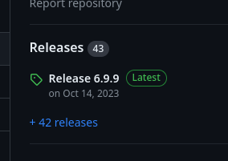
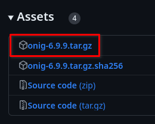

# Packaging oniguruma
[`oniguruma`](https://github.com/kkos/oniguruma) is a regular expression library
written in C. It is a dependency of `bat`. It provides several build systems,
but we'll use the GNU configure build system (as does the official package).

_If you want to follow along, run this:_
```
rm -r srcpkgs/oniguruma*
sed -i /oniguruma/d common/shlibs
```

<!-- toc -->

## Gathering info
The following information is taken from `oniguruma`'s GitHub repo:
<https://github.com/kkos/oniguruma>

- latest `version`: `6.9.9`

  
- `build_style`: `gnu-configure`
- `short_desc`: `Multi-charset regular expressions library`
- `license`: `BSD-2-Clause`
- `homepage`: <https://github.com/kkos/oniguruma>
- `distfiles`: `oniguruma` provides custom archives, but they are not prebuilt:

  

  When that happens, the custom archives should be preferred.

  The link is
  <https://github.com/kkos/oniguruma/releases/download/v6.9.9/onig-6.9.9.tar.gz>

  This link includes `${version}` twice, so it has to be substituted twice:

  ~~~admonish failure title="Bad"
  `distfiles="https://github.com/kkos/oniguruma/releases/download/v6.9.9/onig-${version}.tar.gz"`
  ~~~

  ~~~admonish success title="Good"
  `distfiles="https://github.com/kkos/oniguruma/releases/download/v${version}/onig-${version}.tar.gz"`
  ~~~

## A word about subpackages
A package can have
[subpackages](https://github.com/void-linux/void-packages/blob/master/Manual.md#subpackages).
This is useful to for example separate large documentation from a program.

But this feature is used the most for `-devel` packages. All libraries usually
provide (at least) two packages: the main package and a `-devel` package.

The main package contains the core (dynamic) library. It is needed for programs
which depend on this library.

The `-devel` package contains development files needed to **compile** projects
that depend on the library. It includes extra symbolic links to the dynamic
library, static libraries, pkg-config files, CMake files, header files and more.

The `-devel` package should always depend on the main package. Installing the
`-devel` package should install both.

This is how officially packaged `oniguruma` does it:

```
> xbps-query -Rf oniguruma
/usr/lib/libonig.so.5.4.0
/usr/share/licenses/oniguruma/COPYING
/usr/lib/libonig.so.5 -> /usr/lib/libonig.so.5.4.0
```

```
> xbps-query -Rf oniguruma-devel
/usr/bin/onig-config
/usr/include/oniggnu.h
/usr/include/onigposix.h
/usr/include/oniguruma.h
/usr/lib/libonig.a
/usr/lib/pkgconfig/oniguruma.pc
/usr/lib/libonig.so -> /usr/lib/libonig.so.5.4.0
```

Here you can see `onig-config`, which is a shell script used for development,
you can see header files, a static library, pkg-config file and an unversioned
symbolic link.

## Creating the template
We can use `xnew` to create the template and fill out what we know. The `-devel`
subpackage can be specified as the second argument of `xnew`:

```
xnew oniguruma oniguruma-devel
```

You'll see this:
```bash
# Template file for 'oniguruma'
pkgname=oniguruma
version=
revision=1
#archs="i686 x86_64"
#build_wrksrc=
build_style=gnu-configure
#configure_args=""
#make_build_args=""
#make_install_args=""
#conf_files=""
#make_dirs="/var/log/dir 0755 root root"
hostmakedepends=""
makedepends=""
depends=""
short_desc=""
maintainer="meator <meator.dev@gmail.com>"
license="GPL-3.0-or-later"
homepage=""
#changelog=""
distfiles=""
checksum=badbadbadbadbadbadbadbadbadbadbadbadbadbadbadbadbadbadbadbadbadb

oniguruma-devel_package() {
	depends="${sourcepkg}>=${version}_${revision}"
	short_desc+=" - development files"
	pkg_install() {
		vmove usr/share/man/man3
		vmove usr/include
		vmove usr/lib/pkgconfig
		vmove "usr/lib/*.a"
		vmove "usr/lib/*.so"
	}
}
```

Subpackages are defined with the `<subpackage name>_package()` function. As you
can see, it depends on the "parent" package `oniguruma`. `xnew` has detected
that the `-devel` package is a development package and it has prefilled
`short_desc` and the `pkg_install()` function.

The `pkg_install()` function makes heavy use of the `vmove` `xbps-src` helper.
It moves `<file>` to `$DESTDIR/<file>`. These two are equivalent:

```
vmove usr/include
mv usr/include $DESTDIR/usr/include
```

`xnew` prefill it with things that should generally appear in a `-devel`
package.

Here is the filled-out template:
```bash
# Template file for 'oniguruma'
pkgname=oniguruma
version=6.9.9
revision=1
build_style=gnu-configure
hostmakedepends=""
makedepends=""
depends=""
short_desc="Multi-charset regular expressions library"
maintainer="meator <meator.dev@gmail.com>"
license="BSD-2-Clause"
homepage="https://github.com/kkos/oniguruma"
distfiles="https://github.com/kkos/oniguruma/releases/download/v${version}/onig-${version}.tar.gz"
checksum=60162bd3b9fc6f4886d4c7a07925ffd374167732f55dce8c491bfd9cd818a6cf

oniguruma-devel_package() {
	depends="${sourcepkg}>=${version}_${revision}"
	short_desc+=" - development files"
	pkg_install() {
		vmove usr/share/man/man3
		vmove usr/include
		vmove usr/lib/pkgconfig
		vmove "usr/lib/*.a"
		vmove "usr/lib/*.so"
	}
}
```

Let's try building it:

```hidelines=~
{{#include ../../data/oniguruma_error.txt}}
```

The package doesn't have any `man3` manpages, so we need to remove the

```
		vmove usr/share/man/man3
```
line:

```bash
# Template file for 'oniguruma'
pkgname=oniguruma
version=6.9.9
revision=1
build_style=gnu-configure
hostmakedepends=""
makedepends=""
depends=""
short_desc="Multi-charset regular expressions library"
maintainer="meator <meator.dev@gmail.com>"
license="BSD-2-Clause"
homepage="https://github.com/kkos/oniguruma"
distfiles="https://github.com/kkos/oniguruma/releases/download/v${version}/onig-${version}.tar.gz"
checksum=60162bd3b9fc6f4886d4c7a07925ffd374167732f55dce8c491bfd9cd818a6cf

oniguruma-devel_package() {
	depends="${sourcepkg}>=${version}_${revision}"
	short_desc+=" - development files"
	pkg_install() {
		vmove usr/include
		vmove usr/lib/pkgconfig
		vmove "usr/lib/*.a"
		vmove "usr/lib/*.so"
	}
}
```

It builds now, but there's a warning:

```hidelines=~
{{#include ../../data/oniguruma_warning.txt}}
```

That's an easy fix:

```bash
# Template file for 'oniguruma'
pkgname=oniguruma
version=6.9.9
revision=1
build_style=gnu-configure
hostmakedepends=""
makedepends=""
depends=""
short_desc="Multi-charset regular expressions library"
maintainer="meator <meator.dev@gmail.com>"
license="BSD-2-Clause"
homepage="https://github.com/kkos/oniguruma"
distfiles="https://github.com/kkos/oniguruma/releases/download/v${version}/onig-${version}.tar.gz"
checksum=60162bd3b9fc6f4886d4c7a07925ffd374167732f55dce8c491bfd9cd818a6cf

oniguruma-devel_package() {
	depends="${sourcepkg}>=${version}_${revision}"
	short_desc+=" - development files"
	pkg_install() {
		vmove usr/bin/onig-config
		vmove usr/include
		vmove usr/lib/pkgconfig
		vmove "usr/lib/*.a"
		vmove "usr/lib/*.so"
	}
}
```

## Shlib dependencies
Only the `-devel` package is usually seen as a dependency of a template. It is
usually specified in `makedepends`. But if you look at the `bat` package, you'll
see this:

```
> xbps-query -Rx bat
glibc>=2.36_1
libgcc>=4.4.0_1
libgit2>=1.6.4_1
oniguruma>=6.8.1_1
```

It depends on `oniguruma>=6.8.1_1` even though the template doesn't even have a
`depends` field. How is that possible?

Each program remembers what dynamic libraries has it been linked with. It
remembers the SONAME of the linked library.

You can query the SONAMEs a library provides with `objdump`
```
> objdump -p /usr/lib/libonig.so.5.4.0 | grep SONAME
  SONAME               libonig.so.5
```

You can query the SONAMEs a program needs similarly:
```
> objdump -p /usr/bin/bat | grep NEEDED
  NEEDED               libonig.so.5
  NEEDED               libgcc_s.so.1
  NEEDED               libm.so.6
  NEEDED               libc.so.6
```

(`libgcc_s`, `libm` and `libc` are core libraries upon which many programs
depend. All of these are transitive or direct dependencies of `base-system`, so
they should be installed on every Void Linux computer[^minimal] & we don't have
to put them to `depends`.)

We see that `oniguruma` provides SONAME `libonig.so.5` and bat needs SONAME
`libonig.so.5`.

`xbps-src` looks for these dependencies. But it needs to be able to resolve a
SONAME to the correct package. This is the purpose of the
[`common/shlibs`](https://github.com/void-linux/void-packages/blob/master/common/shlibs)
file.

I have largely overlooked the `common/` directory. It contains `xbps-src`
internal scripts, definitions of build styles and more. But it also contains the
SONAME to package mapping.

The best example to show how it's working is to showcase when it doesn't work.
Let's do that:

We have a `oniguruma` (and `oniguruma-devel`) template:
```bash
# Template file for 'oniguruma'
pkgname=oniguruma
version=6.9.9
revision=1
build_style=gnu-configure
hostmakedepends=""
makedepends=""
depends=""
short_desc="Multi-charset regular expressions library"
maintainer="meator <meator.dev@gmail.com>"
license="BSD-2-Clause"
homepage="https://github.com/kkos/oniguruma"
distfiles="https://github.com/kkos/oniguruma/releases/download/v${version}/onig-${version}.tar.gz"
checksum=60162bd3b9fc6f4886d4c7a07925ffd374167732f55dce8c491bfd9cd818a6cf

oniguruma-devel_package() {
	depends="${sourcepkg}>=${version}_${revision}"
	short_desc+=" - development files"
	pkg_install() {
		vmove usr/bin/onig-config
		vmove usr/include
		vmove usr/lib/pkgconfig
		vmove "usr/lib/*.a"
		vmove "usr/lib/*.so"
	}
}
```

and we want to build `bat` using the template we crafted in the previous part of
the tutorial:

```bash
# Template file for 'bat'
pkgname=bat
version=0.24.0
revision=1
build_style=cargo
hostmakedepends=pkg-config
makedepends=oniguruma-devel
short_desc="Cat(1) clone with syntax highlighting and Git integration"
maintainer="meator <meator.dev@gmail.com>"
license="Apache-2.0, MIT"
homepage="https://github.com/sharkdp/bat"
changelog="https://raw.githubusercontent.com/sharkdp/bat/master/CHANGELOG.md"
distfiles="https://github.com/sharkdp/bat/archive/refs/tags/v${version}.tar.gz"
checksum=907554a9eff239f256ee8fe05a922aad84febe4fe10a499def72a4557e9eedfb

export BAT_ASSETS_GEN_DIR="${XBPS_BUILDDIR}/${pkgname}-${version}"

post_install() {
	vlicense LICENSE-MIT
	vman assets/manual/bat.1
	vcompletion assets/completions/bat.fish fish
	vcompletion assets/completions/bat.zsh zsh
	vcompletion assets/completions/bat.bash bash
}
```

```admonish warning
Instructions mentioned at the very beginning of this page must have been
followed for this to (not) work.
```

Let's build `oniguruma` and then `bat`:
```
> ./xbps-src pkg oniguruma
> ./xbps-src pkg bat
```

`oniguruma` builds without issues, but the same cannot be said about `bat`:
```hidelines=~
{{#include ../../data/oniguruma-bat-error.txt}}
```

This shows us that we don't have to add every library SONAME to `common/shlibs`,
but we have to add every SONAME REQUIRES.

Note that if the build of `bat` hadn't failed, it would **not** have `oniguruma`
in its runtime dependencies.

If a library is a dependency of another package, we **should** add the SHLIB to
`common/shlibs`, but it isn't mandatory otherwise (but libraries are usually
packaged because they are the dependency of the target executable which the
packager wants, standalone libraries aren't usually packaged and one could even
argue that it wouldn't be accepted because of [packaging
requirements](j4-dmenu-desktop.md#quality-requirements), but it depends).

### How to add a shlib dependency?
The error message emitted by by `./xbps-src pkg bat` already shows the SONAME
which is causing trouble:

```
=> bat-0.24.0_1: running pre-pkg hook: 04-generate-runtime-deps ...
   SONAME: libonig.so.5 <-> UNKNOWN PKG PLEASE FIX!
   SONAME: libgcc_s.so.1 <-> libgcc>=4.4.0_1
   SONAME: libm.so.6 <-> glibc>=2.38_1
   SONAME: libc.so.6 <-> glibc>=2.38_1
```

It is `libonig.so.5`. The header of `common/shlibs` describes it best, so I'll
include it here:

> This file represents a map between shared libraries and packages in XBPS.
  Every shared library installed by a package must be listed here and mapped to
  a binary package.
>
> The first field lists the exact SONAME embedded in binaries.
>
> The second field lists the package/version tuple containing the SONAME.  The
  version component is used as greater than or equal to that version in
  resulting binary package.
>
> The third field (optional) specifies that shared library should not be used to
  perform checks of soname bumps.
>
> PLEASE NOTE: when multiple packages provide the same SONAME, the first one
  (order top->bottom) is preferred over the next ones.

So the correct shlib entry is
```
libonig.so.5 oniguruma-6.9.9_1
```

The list should be kept **in alphabetical order**, we can't just add this line
to the beginning or the end. But this is a stylistic requirement rather than a
functional one.

When you add it, `bat` starts building again. And it'll have `oniguruma` in its
runtime dependencies.

## Subpackages once again
`-devel` packages aren't the only possible use of subpackages in `xbps-src`.
Subpackages can be anything. They can for example include documentation. To
quote from [the
Manual](https://github.com/void-linux/void-packages/blob/master/Manual.md#pkgs_sub):

> In general a `-doc` package is useful, if the main package can be used both
  with or without documentation and the size of the documentation isn't really
  small.  The base package and the `-devel` subpackage should be kept small so
  that when building packages depending on a specific package there is no need to
  install large amounts of documentation for no reason. Thus the size of the
  documentation part should be your guidance to decide whether or not to split off
  a `-doc` subpackage.

And wouldn't you know it, `oniguruma` provides some documentation that could be
put into `oniguruma-doc`. What a coincidence. It's almost like this is a part of
a carefully crafted packaging tutorial or something.

The documentation doesn't get installed to `$DESTDIR` by default, it just lies
in the `doc/` subdirectory of the source. Their build system doesn't install it.[^cmake]
But the documentation doesn't need to be generated ([unlike the manpage and
completions in `bat`](bat.md#installing-supplementary-files)), we can just copy
the files to `$DESTDIR`.

Where will we install the documentation? `usr/share/doc/oniguruma/` is
appropriate. `/usr/share/doc/` is usually used for these sorts of things.

We'll use `vcopy` to install the files this time. But first, we have to create
the `usr/share/doc/oniguruma/` in destdir. `xbps-src` also has a helper for
that, `vmkdir`. `vmkdir`'s functionality, like `vcopy`'s, is pretty apparent
from its name.

Let's get to work:
```bash
# Template file for 'oniguruma'
pkgname=oniguruma
version=6.9.9
revision=1
build_style=gnu-configure
hostmakedepends=""
makedepends=""
depends=""
short_desc="Multi-charset regular expressions library"
maintainer="meator <meator.dev@gmail.com>"
license="BSD-2-Clause"
homepage="https://github.com/kkos/oniguruma"
distfiles="https://github.com/kkos/oniguruma/releases/download/v${version}/onig-${version}.tar.gz"
checksum=60162bd3b9fc6f4886d4c7a07925ffd374167732f55dce8c491bfd9cd818a6cf

oniguruma-devel_package() {
	depends="${sourcepkg}>=${version}_${revision}"
	short_desc+=" - development files"
	pkg_install() {
		vmove usr/bin/onig-config
		vmove usr/include
		vmove usr/lib/pkgconfig
		vmove "usr/lib/*.a"
		vmove "usr/lib/*.so"
	}
}

# This is a modified copy of oniguruma-devel_package()
oniguruma-doc_package() {
	# depends is no longer needed
	#depends="${sourcepkg}>=${version}_${revision}"
	short_desc+=" - documentation"
	pkg_install() {
		vmkdir usr/share/doc/oniguruma
		vcopy "doc/*" usr/share/doc/oniguruma
	}
}
```

We can't use
```bash
		vcopy doc usr/share/doc/oniguruma
```

because that would copy the documentation to `usr/share/doc/oniguruma/doc`.

When using shell wildcards in `xbps-src` helpers that support them, **they must
be properly quoted**.

### Symlinks in subpackages
Although subpackages are created differently from normal packages, they are
still full-fledged packages. And all full-fledged packages must have a directory
in `srcpkgs/<package name>`.

Subpackages _symlink_ their `srcpkgs/` directory to the main package. When you
look into `srcpkgs/`, you might be surprised to find this:

```
srcpkgs/oniguruma-devel/template
```

`srcpkgs/oniguruma-devel` is a symlink to `oniguruma` (in `srcpkgs/`). How did
it get there? You didn't create it. `xnew` did. Remember how we created the
`oniguruma` template at the beginning of this page?
```
xnew oniguruma oniguruma-devel
```

`xnew` recognised that the second argument `oniguruma-devel` is a subpackage and
it has created the symlink in `srcpkgs/` for us. But now, we have added an
`oniguruma-doc` subpackage "manually", so we have to create the symlink:

```
ln -s oniguruma srcpkgs/oniguruma-doc
```

Be careful when dealing with these. Relative symlinks can be tricky to get
right sometimes.

We now have three `oniguruma` packages in `srcpkgs/`
```
drwxr-xr-x 1 meator meator srcpkgs/oniguruma
lrwxrwxrwx 1 meator meator srcpkgs/oniguruma-devel -> oniguruma
lrwxrwxrwx 1 meator meator srcpkgs/oniguruma-doc -> oniguruma
```

This means that we can very well build packages like this:
```
./xbps-src pkg oniguruma-devel
./xbps-src pkg oniguruma-doc
./xbps-src pkg oniguruma
```

All three of these are equivalent. `./xbps-src pkg oniguruma-doc` doesn't just
build the documentation, it builds all (sub)packages of `oniguruma` because
`srcpkgs/oniguruma-doc` is actually `srcpkgs/oniguruma`.

## Cleaning up
This is our template so far:
```bash
# Template file for 'oniguruma'
pkgname=oniguruma
version=6.9.9
revision=1
build_style=gnu-configure
hostmakedepends=""
makedepends=""
depends=""
short_desc="Multi-charset regular expressions library"
maintainer="meator <meator.dev@gmail.com>"
license="BSD-2-Clause"
homepage="https://github.com/kkos/oniguruma"
distfiles="https://github.com/kkos/oniguruma/releases/download/v${version}/onig-${version}.tar.gz"
checksum=60162bd3b9fc6f4886d4c7a07925ffd374167732f55dce8c491bfd9cd818a6cf

oniguruma-devel_package() {
	depends="${sourcepkg}>=${version}_${revision}"
	short_desc+=" - development files"
	pkg_install() {
		vmove usr/bin/onig-config
		vmove usr/include
		vmove usr/lib/pkgconfig
		vmove "usr/lib/*.a"
		vmove "usr/lib/*.so"
	}
}

oniguruma-doc_package() {
	short_desc+=" - documentation"
	pkg_install() {
		vmkdir usr/share/doc/oniguruma
		vcopy "doc/*" usr/share/doc/oniguruma
	}
}
```

`oniguruma` is a very self-contained library and it has no dependencies, so we
won't need any of the `*depends` variables:

```bash
# Template file for 'oniguruma'
pkgname=oniguruma
version=6.9.9
revision=1
build_style=gnu-configure
short_desc="Multi-charset regular expressions library"
maintainer="meator <meator.dev@gmail.com>"
license="BSD-2-Clause"
homepage="https://github.com/kkos/oniguruma"
distfiles="https://github.com/kkos/oniguruma/releases/download/v${version}/onig-${version}.tar.gz"
checksum=60162bd3b9fc6f4886d4c7a07925ffd374167732f55dce8c491bfd9cd818a6cf

oniguruma-devel_package() {
	depends="${sourcepkg}>=${version}_${revision}"
	short_desc+=" - development files"
	pkg_install() {
		vmove usr/bin/onig-config
		vmove usr/include
		vmove usr/lib/pkgconfig
		vmove "usr/lib/*.a"
		vmove "usr/lib/*.so"
	}
}

oniguruma-doc_package() {
	short_desc+=" - documentation"
	pkg_install() {
		vmkdir usr/share/doc/oniguruma
		vcopy "doc/*" usr/share/doc/oniguruma
	}
}
```

Let's see what `xlint` has to say:
```
> xlint oniguruma
oniguruma:8: license 'BSD', but no use of vlicense
```

`BSD-2-Clause` is one of the licenses which require installation. The solution
is the same [as in `bat`](bat.md#installing-licenses):

```bash
# Template file for 'oniguruma'
pkgname=oniguruma
version=6.9.9
revision=1
build_style=gnu-configure
short_desc="Multi-charset regular expressions library"
maintainer="meator <meator.dev@gmail.com>"
license="BSD-2-Clause"
homepage="https://github.com/kkos/oniguruma"
distfiles="https://github.com/kkos/oniguruma/releases/download/v${version}/onig-${version}.tar.gz"
checksum=60162bd3b9fc6f4886d4c7a07925ffd374167732f55dce8c491bfd9cd818a6cf

post_install() {
	vlicense COPYING
}

oniguruma-devel_package() {
	depends="${sourcepkg}>=${version}_${revision}"
	short_desc+=" - development files"
	pkg_install() {
		vmove usr/bin/onig-config
		vmove usr/include
		vmove usr/lib/pkgconfig
		vmove "usr/lib/*.a"
		vmove "usr/lib/*.so"
	}
}

oniguruma-doc_package() {
	short_desc+=" - documentation"
	pkg_install() {
		vmkdir usr/share/doc/oniguruma
		vcopy "doc/*" usr/share/doc/oniguruma
	}
}
```

The license file is called `COPYING` in `oniguruma`.

A repeated run of `xlint` returns no findings.

## Comparing with the upstream template
This is our template:
```bash
# Template file for 'oniguruma'
pkgname=oniguruma
version=6.9.9
revision=1
build_style=gnu-configure
short_desc="Multi-charset regular expressions library"
maintainer="meator <meator.dev@gmail.com>"
license="BSD-2-Clause"
homepage="https://github.com/kkos/oniguruma"
distfiles="https://github.com/kkos/oniguruma/releases/download/v${version}/onig-${version}.tar.gz"
checksum=60162bd3b9fc6f4886d4c7a07925ffd374167732f55dce8c491bfd9cd818a6cf

post_install() {
	vlicense COPYING
}

oniguruma-devel_package() {
	depends="${sourcepkg}>=${version}_${revision}"
	short_desc+=" - development files"
	pkg_install() {
		vmove usr/bin/onig-config
		vmove usr/include
		vmove usr/lib/pkgconfig
		vmove "usr/lib/*.a"
		vmove "usr/lib/*.so"
	}
}

oniguruma-doc_package() {
	short_desc+=" - documentation"
	pkg_install() {
		vmkdir usr/share/doc/oniguruma
		vcopy "doc/*" usr/share/doc/oniguruma
	}
}
```

with the following SHLIB entry:
```
libonig.so.5 oniguruma-6.9.9_1
```

and with the following subpackage symlinks:
```
lrwxrwxrwx 1 meator meator srcpkgs/oniguruma-devel -> oniguruma
lrwxrwxrwx 1 meator meator srcpkgs/oniguruma-doc -> oniguruma
```

This is the official template as of the time of writing this tutorial:
```bash
# Template file for 'oniguruma'
pkgname=oniguruma
version=6.9.9
revision=1
build_style=gnu-configure
configure_args="--enable-posix-api=yes"
short_desc="Multi-charset regular expressions library"
maintainer="Orphaned <orphan@voidlinux.org>"
license="BSD-2-Clause"
homepage="https://github.com/kkos/oniguruma"
changelog="https://github.com/kkos/oniguruma/releases"
distfiles="https://github.com/kkos/oniguruma/releases/download/v${version}/onig-${version}.tar.gz"
checksum=60162bd3b9fc6f4886d4c7a07925ffd374167732f55dce8c491bfd9cd818a6cf

post_install() {
	vlicense COPYING
}

oniguruma-devel_package() {
	short_desc+=" - development files"
	depends="${sourcepkg}>=${version}_${revision}"
	pkg_install() {
		vmove usr/bin/onig-config
		vmove usr/include
		vmove "usr/lib/*.a"
		vmove "usr/lib/*.so"
		vmove usr/lib/pkgconfig
	}
}

oniguruma-doc_package() {
	short_desc+=" - documentation"
	pkg_install() {
		vmkdir usr/share/doc/${sourcepkg}
		vcopy "doc/*" usr/share/doc/${sourcepkg}
	}
}
```

with the following SHLIB entry:
```
libonig.so.5 oniguruma-6.8.1_1
```

and with the following subpackage symlinks:
```
lrwxrwxrwx 1 meator meator srcpkgs/oniguruma-devel -> oniguruma
lrwxrwxrwx 1 meator meator srcpkgs/oniguruma-doc -> oniguruma
```

The two templates are very similar, which is good.

The official SHLIB entry is a bit out of date, it's using `oniguruma-6.8.1_1`
while the latest is `oniguruma-6.9.9_1`. That isn't a problem, because "The
version component is used as greater than or equal to that version in
resulting binary package".

The upstream template adds
```bash
configure_args="--enable-posix-api=yes"
```

This tells `oniguruma`'s build system GNU configure that it should enable POSIX
APIs. I am not entirely sure what it does, but I'm sure it serves an important
purpose and it shouldn't be removed. This is not related to `xbps-src` package
management, this is an `oniguruma`-specific thing. If you happen to need to
use some "magic flags" in your template, you should document them with an
accompanying comment.

The official template uses `${sourcepkg}` in some places. Excessive use of
`${sourcepkg}` or `$pkgname` isn't good. Package names don't change often, so
handling the name dynamically serves no practical purpose.

## What now?
I'm sure you're pretty tired of `bat` now. Let's package something completely
different: [`rofimoji`](https://github.com/fdw/rofimoji):

[Packaging rofimoji](rofimoji.md)

[^minimal]: Some people (although they are a minority) use an alternative
            `base-` package instead of `base-system` for their system. But these
            dependencies are so basic that even these people should have them.
[^cmake]: As I mentioned at the very beginning of the page, `oniguruma` has multiple
          build systems. I wasn't able to find anything related to documentation
          in their configure script, but their `CMakeLists.txt` [has an option
          for installing
          documentation](https://github.com/kkos/oniguruma/blob/e62a8e5ec123bb91651d297e6f72c84d53e3cff8/CMakeLists.txt#L211-L222).
