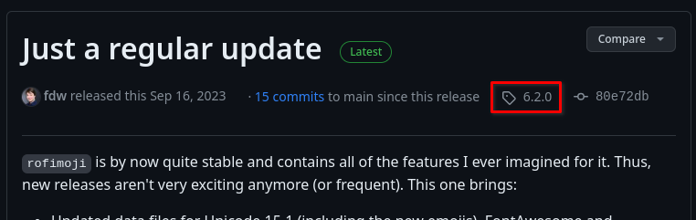

# Packaging rofimoji

[`rofimoji`](https://github.com/fdw/rofimoji) is a character picker for
[rofi](https://github.com/davatorium/rofi).  It is written in Python and it's
compatible with [PEP 517](https://peps.python.org/pep-0517/).

_If you want to follow along, run this:_

```
rm -r srcpkgs/rofimoji
```

<!-- toc -->

## Gathering info
Repository used for gathering the info: <https://github.com/fdw/rofimoji>

- latest `version`: `6.2.0`

  

  
- `build style`: `python3-pep517` (described below)
- `short_desc`: `Emoji, unicode and general character picker for rofi and
  rofi-likes` (taken from GitHub description, something more concise could be
  used)
- `license`: `MIT`
- `homepage`: <https://github.com/fdw/rofimoji>
- `changelog`: <https://raw.githubusercontent.com/fdw/rofimoji/main/CHANGELOG.md>
- `distfiles`: <https://github.com/fdw/rofimoji/archive/refs/tags/6.2.0.tar.gz>

## Python's packaging systems
Python is known for it's complicated build systems. Explaining them is beyond
the scope of this tutorial (and beyond the scope of my comprehension to be
honest).

But thankfully `xbps-src`'s build systems do most of the job. It provides the
following build styles: `python2-module`, `python3-module` and `python3-pep517`
The `-module` styles use `setup.py` which is kinda deprecated (I recommend you
reading [this
article](https://blogs.gentoo.org/mgorny/2021/11/07/the-future-of-python-build-systems-and-gentoo/)
for more info) and the `python3-pep517` (as the name implies) uses [PEP
517](https://peps.python.org/pep-0517/).

`rofimoji` uses `python3-pep517`.

## Creating the template
```
xnew rofimoji
```

```bash
# Template file for 'rofimoji'
pkgname=rofimoji
version=
revision=1
#archs="i686 x86_64"
#build_wrksrc=
build_style=gnu-configure
#configure_args=""
#make_build_args=""
#make_install_args=""
#conf_files=""
#make_dirs="/var/log/dir 0755 root root"
hostmakedepends=""
makedepends=""
depends=""
short_desc=""
maintainer="meator <meator.dev@gmail.com>"
license="GPL-3.0-or-later"
homepage=""
#changelog=""
distfiles=""
checksum=badbadbadbadbadbadbadbadbadbadbadbadbadbadbadbadbadbadbadbadbadb
```

Let's fill it out:

```bash
# Template file for 'rofimoji'
pkgname=rofimoji
version=6.2.0
revision=1
build_style=python3-pep517
hostmakedepends=""
makedepends=""
depends=""
short_desc="Emoji, unicode and general character picker for rofi and rofi-likes"
maintainer="meator <meator.dev@gmail.com>"
license="MIT"
homepage="https://github.com/fdw/rofimoji"
changelog="https://raw.githubusercontent.com/fdw/rofimoji/main/CHANGELOG.md"
distfiles="https://github.com/fdw/rofimoji/archive/refs/tags/6.2.0.tar.gz"
checksum=badbadbadbadbadbadbadbadbadbadbadbadbadbadbadbadbadbadbadbadbadb
```

```
xgensum -i rofimoji
```

```bash
# Template file for 'rofimoji'
pkgname=rofimoji
version=6.2.0
revision=1
build_style=python3-pep517
hostmakedepends=""
makedepends=""
depends=""
short_desc="Emoji, unicode and general character picker for rofi and rofi-likes"
maintainer="meator <meator.dev@gmail.com>"
license="MIT"
homepage="https://github.com/fdw/rofimoji"
changelog="https://raw.githubusercontent.com/fdw/rofimoji/main/CHANGELOG.md"
distfiles="https://github.com/fdw/rofimoji/archive/refs/tags/6.2.0.tar.gz"
checksum=21da8e6879ac16d774f3ce6dfcd1783cec891ad172617eead2c10597f477d9a9
```

Let's do [some housekeeping](../troubleshooting.md#check-these-first) for good
measure:

```
./xbps-src clean
git pull --rebase upstream master
```

Now, we can build:

```hidelines=~
> ./xbps-src pkg rofimoji
{{#include ../../data/rofimoji_error1.txt}}
```

`ModuleNotFoundError: No module named 'poetry'` `poetry` is missing.
`xbps-query` shows us this:

```
> xbps-query -Rs poetry
[-] python3-poetry-core-1.5.0_2 Poetry PEP 517 Build Backend & Core Utilities
```

This is our dependency. But I should talk about dependencies more.

## Dependencies for interpreted packages
As I've mentioned in [the cross compilation section of packaging
j4-dmenu-desktop](j4-dmenu-desktop.md#what-is-cross-compilation), cross
compilation isn't really a thing for interpreted languages like Python.

```admonish
This is true for
**pure** Python. Some Python code can have C or C++ extensions (usually handled
by [Cython](https://cython.org/)). If that is the case, rules of cross
compilation described earlier still hold true.
```

Because of this, a lot of things that require close attention for compiled
packages can be ignored for interpreted ones.

For example, you usually doesn't have to distinguish `hostmakedepends` and
`makedepends`. All dependencies which should be present in the masterdir should
be defined in `hostmakedepends`. `makedepends` isn't usually used.

One exception to this rule are Python compiled extensions. These usually have

```bash
makedepends="python3-devel"
```

One disadvantage of interpreted packages is that [Shlib
detection](oniguruma.md#shlib-dependencies) doesn't exist for them.  This means
that you have to manually add all dependencies to `depends`.

## Hunting for dependencies
As you may know, the main package manager for Python is `pip`. It uses the
[PyPI](https://pypi.org/) repository.

Because Python projects already integrate with a package manager, they have to
be aware of their dependencies. This can greatly simplify dependency hunting.

To quote the [Manual](https://github.com/void-linux/void-packages/blob/master/Manual.md#python-packages)

> Python packages that rely on `python3-setuptools` should generally map
  `setup_requires` dependencies in `setup.py` to `hostmakedepends` in the
  template and `install_requires` dependencies to `depends` in the template;
  include `python3` in `depends` if there are no other python dependencies.

This advice applies for PEP 517 too, you'll just have to look for the
dependencies in different places.

Let's look at [`rofimoji`'s
`pyproject.toml`](https://github.com/fdw/rofimoji/blob/6.2.0/pyproject.toml):

```toml
[tool.poetry]
name = "rofimoji"
version = "6.2.0"

...

[tool.poetry.dependencies]
python = "^3.8"
ConfigArgParse = "^1.3"

...

[build-system]
requires = ["poetry-core>=1.0.0"]
build-backend = "poetry.core.masonry.api"

...
```

Here we see that `rofimoji` depends on Python (this isn't much of a surprise)
and it depends on `ConfigArgParse`.

It also depends on its build system, `poetry-core`.

Upstream's build system will help you figure out the dependencies, but it won't
find them for you. The dependencies will likely have a different name in PyPI
than on Void. They also might not be packaged or they might be packaged
differently compared to the PyPI version (but this is unlikely).

`xbps-query -Rs` is usually enough to figure out dependencies:

```
> xbps-query -Rs poetry-core
[-] python3-poetry-core-1.5.0_2 Poetry PEP 517 Build Backend & Core Utilities
```

```
> xbps-query -Rs ConfigArgParse
[-] python3-ConfigArgParse-1.7_1 Drop-in replacement for argparse
```

Let's fix the template:

```bash
# Template file for 'rofimoji'
pkgname=rofimoji
version=6.2.0
revision=1
build_style=python3-pep517
hostmakedepends="python3 python3-poetry-core"
depends="python3-ConfigArgParse"
short_desc="Emoji, unicode and general character picker for rofi and rofi-likes"
maintainer="meator <meator.dev@gmail.com>"
license="MIT"
homepage="https://github.com/fdw/rofimoji"
changelog="https://raw.githubusercontent.com/fdw/rofimoji/main/CHANGELOG.md"
distfiles="https://github.com/fdw/rofimoji/archive/refs/tags/6.2.0.tar.gz"
checksum=21da8e6879ac16d774f3ce6dfcd1783cec891ad172617eead2c10597f477d9a9
```

And that's it. The template builds without issues now.

Let's run `xlint`:
```
> xlint rofimoji
rofimoji:10: license 'MIT', but no use of vlicense
```

That's a simple fix:

```bash
# Template file for 'rofimoji'
pkgname=rofimoji
version=6.2.0
revision=1
build_style=python3-pep517
hostmakedepends="python3 python3-poetry-core"
depends="python3-ConfigArgParse"
short_desc="Emoji, unicode and general character picker for rofi and rofi-likes"
maintainer="meator <meator.dev@gmail.com>"
license="MIT"
homepage="https://github.com/fdw/rofimoji"
changelog="https://raw.githubusercontent.com/fdw/rofimoji/main/CHANGELOG.md"
distfiles="https://github.com/fdw/rofimoji/archive/refs/tags/6.2.0.tar.gz"
checksum=21da8e6879ac16d774f3ce6dfcd1783cec891ad172617eead2c10597f477d9a9

post_install() {
	vlicense LICENSE
}
```

## Comparing with upstream template
This is our template:

```bash
# Template file for 'rofimoji'
pkgname=rofimoji
version=6.2.0
revision=1
build_style=python3-pep517
hostmakedepends="python3 python3-poetry-core"
depends="python3-ConfigArgParse"
short_desc="Emoji, unicode and general character picker for rofi and rofi-likes"
maintainer="meator <meator.dev@gmail.com>"
license="MIT"
homepage="https://github.com/fdw/rofimoji"
changelog="https://raw.githubusercontent.com/fdw/rofimoji/main/CHANGELOG.md"
distfiles="https://github.com/fdw/rofimoji/archive/refs/tags/6.2.0.tar.gz"
checksum=21da8e6879ac16d774f3ce6dfcd1783cec891ad172617eead2c10597f477d9a9

post_install() {
	vlicense LICENSE
}
```

This is the official template:

```bash
# Template file for 'rofimoji'
pkgname=rofimoji
version=6.2.0
revision=1
build_style=python3-pep517
hostmakedepends="python3-poetry-core"
depends="python3-ConfigArgParse"
short_desc="Simple character picker using rofi"
maintainer="Marcin Puc <tranzystorek.io@protonmail.com>"
license="MIT"
homepage="https://github.com/fdw/rofimoji"
changelog="https://raw.githubusercontent.com/fdw/rofimoji/main/CHANGELOG.md"
distfiles="https://github.com/fdw/rofimoji/archive/refs/tags/${version}.tar.gz"
checksum=21da8e6879ac16d774f3ce6dfcd1783cec891ad172617eead2c10597f477d9a9

post_install() {
	vlicense LICENSE
	vman src/picker/docs/rofimoji.1
}
```

These two templates are almost identical, which is a good sign.

Official template's `short_desc` is more concise than ours. It also installs the
manpage, which is useful.

## The end?
Well, you've made it. This is the end of the practical part of this tutorial.
You should now be able to package your own programs, libraries or other things
using `xbps-src`. You now know the many helpful features of `xbps-src` that
should simplify packaging.

This tutorial doesn't cover the entirety of `xbps-src` and it doesn't try to do
so. Look in the
[Manual](https://github.com/void-linux/void-packages/blob/master/Manual.md) for
that. Now that you know the basics, you should be able to comprehend it well.

Knowing the basics is also good when [asking for
help](index.md#irc). I have often seen people in
`#voidlinux` trying to solve some problem with their template while not knowing
the basics of `xbps-src`. This can complicate troubleshooting for both parties.

You should now have working package(s). You might want to contribute them. If
yes, continue reading:

[Contributing](contributing.md)
