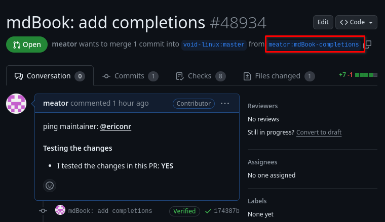
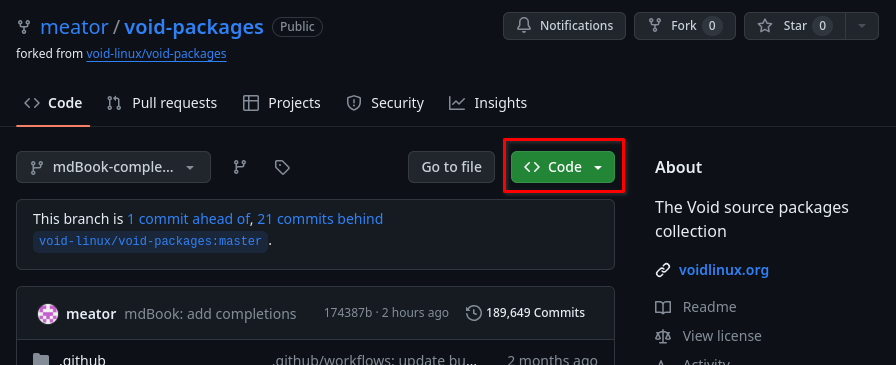
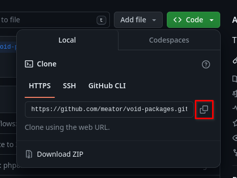
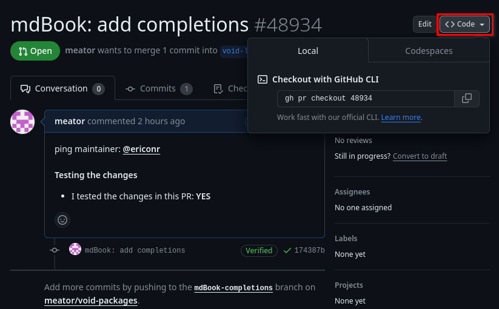
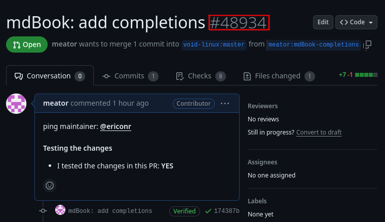

# PR testing tutorial

**This tutorial is up to date as of September 29, 2024**

This tutorial will guide you through testing changes made in an open pull
request in [`void-packages`](https://github.com/void-linux/void-packages).

**Prerequisites**

- basic knowledge of Git
- basics of CLI

---

<!-- toc -->

## Cloning
The steps to follow differ depending on whether you already have a
[`void-packages`](https://github.com/void-linux/void-packages) clone.

- You don’t have a `void-packages` clone
   - [You want to try out a singe PR and never touch `void-packages`
   again](#you-want-to-try-out-a-singe-pr-and-never-touch-void-packages-again)
   - [You want to have `void-packages` for future
   use](#you-want-to-have-void-packages-for-future-use)
- [You have a `void-packages` clone](#you-have-a-void-packages-clone)

### You don't have a `void-packages` clone
#### You want to try out a singe PR and never touch `void-packages` again
You should go to the pull request you want to test:



Click on the highlighted link. It will take you to the forked repository of the
author of the pull request.

Press the `Code` button:


Copy the HTTPS or SSH link according to your preference (if you do not have one,
choose HTTPS):


You should also know the name of the branch from the first picture. Here it's
`mdBook-completions`.

Now, clone the repo using a terminal:
```sh
# Replace these!                             vvvvvvvvvvvvvvvvvv vvvvvvvvvvvvvvvvvvvvvvvvvvvvvvvvvvvvvvvvvvv
git clone --depth 1 --single-branch --branch=mdBook-completions https://github.com/meator/void-packages.git
```

You must replace the branch and the link with yours.

Don't forget to enter your freshly downloaded clone:
```sh
cd void-packages
```

You can now continue with [Setting up the builddir](#setting-up-the-builddir).

#### You want to have `void-packages` for future use
You can clone the repository with
```sh
git clone https://github.com/void-linux/void-packages.git
# or with SSH
#git clone git@github.com:void-linux/void-packages.git
```
This takes about 15 minutes and 626MiB on my laptop.

To speed this up, you can look at [different ways of
cloning](tips-and-tricks.md#different-ways-of-cloning). But the full clone
should be preferred.

Don't forget to enter your freshly downloaded clone:
```sh
cd void-packages
```

You can then continue with [You have a `void-packages`
clone](#you-have-a-void-packages-clone).

### You have a `void-packages` clone
There are two ways to check out a PR: with `gh` or with `git`.

#### gh
This method requires `github-cli` to be installed.

`github-cli` requires authentication to your GitHub account. If you aren't
authenticated, `gh` will show you instructions on how to authenticate.

You can check out the pull request by
```
gh pr checkout 48934
```

GitHub has a handy button for that:


`gh` may prompt you to set the default repository when first running it. You
should select `void-linux/void-packages`.

#### git
You'll have to figure out the pull request number. You can find it here:



The generic process looks like this[^source]:
```
git fetch upstream pull/<number>/head:<some branch name>
git checkout <some branch name>
```

```admonish warning
`<some branch name>` should be an unique branch name. Don't choose `master`!
```

I will showcase it on the pull request mentioned above.

You first have to add the upstream repo as a remote (if you don't have it
already):
```sh
git remote add upstream git@github.com:void-linux/void-packages.git
# Or with HTTPS:
#git remote add upstream https://github.com/void-linux/void-packages.git
```

Then you have to fetch the PR and check out to it. In the following sample, I'm
cloning PR number `48934` to branch `mdbook-compl`:

```
git fetch upstream pull/48934/head:mdbook-compl
git checkout mdbook-compl
```

## Updating
```admonish warning
Skip this section if you have followed [You want to try out a singe PR and never
touch `void-packages`
again](#you-want-to-try-out-a-singe-pr-and-never-touch-void-packages-again).
```

The pull request might be a bit out of date when compared to
[`void-packages`](https://github.com/void-linux/void-packages). This can result
in problems. To update it, you must have the `upstream` remote. Your `git remote
-v` should look like this (with the target fork instead of
`meator/void-packages.git`):

```
origin	git@github.com:meator/void-packages.git (fetch)
origin	git@github.com:meator/void-packages.git (push)
upstream	git@github.com:void-linux/void-packages.git (fetch)
upstream	git@github.com:void-linux/void-packages.git (push)
```

or like this for HTTPS:

```
origin	https://github.com/meator/void-packages.git (fetch)
origin	https://github.com/meator/void-packages.git (push)
upstream	https://github.com/void-linux/void-packages.git (fetch)
upstream	https://github.com/void-linux/void-packages.git (push)
```

If you do not have the `upstream` entry, you must add it:
```sh
git remote add upstream https://github.com/void-linux/void-packages.git
# Or with SSH
#git remote add upstream git@github.com:void-linux/void-packages.git
```

If you have the `upstream` entry, you can update the branch using it:
```
git pull --rebase upstream master
```

If merge conflicts arise, you'll have to fix them or use the older version in
the PR without updating it.

## Setting up the builddir
_Skip this if you have a builddir._

You can set up the builddir with
```
./xbps-src binary-bootstrap
```

This takes about two minutes on my laptop.

## Building
You can build the package with
```
./xbps-src pkg <package>
```

here it would be
```
./xbps-src pkg mdBook
```

## Installing
This requires the `xtools` package.

Run
```
sudo xi -f <package>
```

here it would be
```
sudo xi -f mdBook
```

And that's it. If you don't want to build any more packages, you can run
```
./xbps-pkg zap
```
to delete the masterdir. This can save up space.

If you only wanted to install the package and don't care about `void-packages`
any more, you can remove the clone now.

## Feedback
You should comment on the original pull request and share your experiences with
the package. If you have encountered any problems with it, you should report
them.

[^source]: Taken from
           [here](https://github.com/void-linux/void-packages/blob/master/CONTRIBUTING.md#testing-pull-requests).
