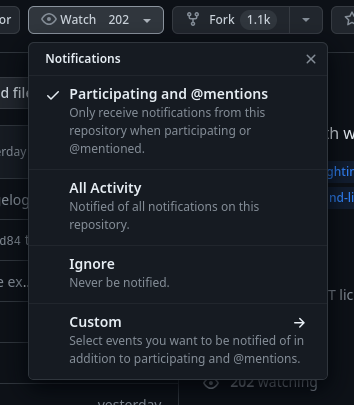
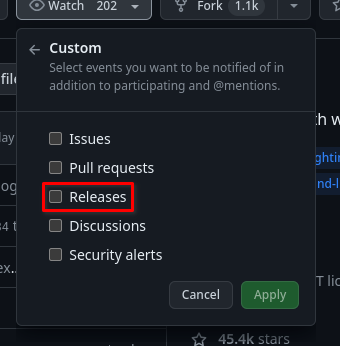

# Tips and tricks

<!-- toc -->

## Speed up repeated builds
When debugging a bailing template build, you need to build the template
repeatedly a lot. This can be lengthy. Using `ccache` can greatly speed up the
process for supported programming languages (mainly C and C++ projects).

You can enable it with the [`XBPS_CCACHE`
option:](https://github.com/void-linux/void-packages/blob/master/etc/defaults.conf#L51-L56)

```bash
# [OPTIONAL]
# Enable or disable ccache when building packages. The ccache directory
# is stored in the hostdir, i.e hostdir/ccache. For go builds this enables
# caching in hostdir/gocache.
#
#XBPS_CCACHE=yes
```

You must put
```bash
XBPS_CCACHE=yes
```
to `etc/conf`.

## Show dependency install progress
Some packages may have large dependencies that take a long time to download.
`xbps-src` shows no progress monitor whatsoever for installing dependency
packages to the masterdir, but it is still available if you know where to look.
You can query this info with

```
tail -f masterdir-x86_64/builddir/.xbps-*/*_bdep_*.log
```

Change `masterdir-x86_64` to your chosen masterdir if appropriate.

You should also consider reading [the following
tip](#speeding-up-dependency-fetching).

## Speed up dependency fetching
`xbps-src` uses your computer's XBPS mirror by default[^foreign]. If the
dependency fetching is slow, you should consider [changing your
mirror](https://docs.voidlinux.org/xbps/repositories/mirrors/changing.html).

If you want to only change
[`void-packages`](https://github.com/void-linux/void-packages)' mirror, you can
set [the
`XBPS_MIRROR`](https://github.com/void-linux/void-packages/blob/master/etc/defaults.conf#L17-L21)
option in `etc/conf`:

```
[OPTIONAL]
Use an alternative mirror for remote repositories. This is more
convenient than modifying etc/xbps.d/repos-remote*.conf.

XBPS_MIRROR=https://repo-us.voidlinux.org/current
```

[`void-packages`](https://github.com/void-linux/void-packages)' repocache is
separate from your computer's repocache. If downloading the dependencies is
taking time, you can reuse your computer's repocache to speed things up.

Because a large part of `xbps-src` is run in masterdir chrooot, you can't just
point `xbps-src` to your repocache, because it doesn't exist within the chroot.
There are two ways to bypass this: use a custom remote repository or copy the
files to `void-package`' repocache. The first approach is complicated and it's
beyond the scope of this article.

To copy all your cached packages to `xbps-src`'s repocache, run this:

```
cp /var/cache/xbps/* hostdir/repocache-$(xbps-uhelper arch)
```

This will be slow & it will take up space. You should consider copying only the
needed packages for the build to `void-packages`' repocache (this is the
advantage of custom remote repo, XBPS will cherry pick what to download with
it).

Copying all your cached packages to `void-packages`' repocache may be slower
than downloading the dependencies.

If you are using a filesystem which supports Copy on Write (like `btrfs` or
`xfs`; `ext4` doesn't support it) and your `/var/cache/xbps` resides on the same
partition as your `void-packages` clone (i.e. you don't have separate `/home`
partition)[^fs], this approach can be almost instant with reflinks enabled:

```
cp --reflink=always /var/cache/xbps/* hostdir/repocache-$(xbps-uhelper arch)
```

## Setting environmental variables
The preferred way to set environmental variables is through variables provided
by the build style. But if that isn't possible, you can just export them in the
template (remember, templates are just bash scripts).

## Reproduce checks locally
Checks in pull requests can sometimes fail when making a pull request. It is
useful to reproduce the error locally to debug it. The GitHub Actions error log
is often not sufficient for debugging.

The following architectures are checked:

| target architecture | host architecture | Are we cross compiling? | Are tests built? |
| - | - | - | - |
| `x86_64` | `x86_64` | no | yes |
| `i686` | `i686` | no | yes |
| `aarch64` | `x86_64` | yes | no |
| `armv7l` | `x86_64` | yes | no |
| `x86_64-musl` | `x86_64-musl` | no | yes |
| `armv6l-musl` | `x86_64-musl` | yes | no |
| `aarch64-musl` | `x86_64-musl` | yes | no |

I assume you are on `x86_64` (I make this assumption in the entire tutorial as
I've mentioned in
[j4-dmenu-desktop](xbps-src-tutorial/packaging-j4-dmenu-desktop.md#void-packages-structure)). The
following instructions can be easily changed to fit other architectures as well.
For example if you are on `musl`, you won't have to create a special builddir
for `x86_64-musl` because that is your default builddir.

The first `x86_64->x86_64` build should correspond to a normal build on your
computer with the `-Q` flag.

Here's `i686->i686` setup (documented in [void-packages
README](https://github.com/void-linux/void-packages/blob/master/README.md#building-32bit)):
```sh
# Don't run the following line if masterdir-i686/ exists.
./xbps-src -A i686 binary-bootstrap
./xbps-src -A i686 -Q pkg <package>
```

Here's `x86_64->aarch64` setup:
```sh
./xbps-src -a aarch64 pkg <package>
```

Here's `x86_64->armv7l` setup:
```sh
./xbps-src -a armv7l pkg <package>
```

Here's `x86_64-musl->x86_64-musl` setup: (documented in [void-packages
README](https://github.com/void-linux/void-packages/blob/master/README.md#building-for-musl)):
```sh
# Don't run the following line if masterdir-x86_64-musl/ exists.
./xbps-src -A x86_64-musl binary-bootstrap
./xbps-src -A x86_64-musl -Q pkg <package>
```

Here's `x86_64-musl->armv6l-musl` setup:
```sh
# Don't run the following line if masterdir-x86_64-musl/ exists.
./xbps-src -A x86_64-musl binary-bootstrap
./xbps-src -A x86_64-musl -a armv6l-musl pkg <package>
```

Here's `x86_64-musl->aarch64-musl` setup:
```sh
# Don't run the following line if masterdir-x86_64-musl/ exists.
./xbps-src -A x86_64-musl binary-bootstrap
./xbps-src -A x86_64-musl -a aarch64-musl pkg <package>
```

The advantage of testing locally is that you can examine the `builddir` and
`destdir` after the build fails.

## Runtime dependency checking with Docker
It can be hard to check for runtime dependencies. Your computer probably has a
lot of packages installed so the dependencies of the template you're testing can
be satisfied by chance. This means that testing whether the package runs on your
computer by installing it and running it can be unreliable. Some runtime
dependencies may be overlooked.

When that happens, the package may fail for someone who has a more
minimal Void install or someone who simply doesn't happen to have the dependency
installed.

The best way to check that you have identified all the needed runtime
dependencies of the template is to try to use the package on a minimal Void
install. One of the most practical ways to achieve this is using Docker.

_I assume you know Docker._

Void Linux provides it's containers at
<https://github.com/orgs/void-linux/packages?repo_name=void-containers>

```admonish warning
**Don't** use the [DocherHub Void Linux
containers](https://hub.docker.com/r/voidlinux/voidlinux)! They are three years
old! Void Linux switched from DockerHub to GHCR, DockerHub images are no longer
maintained.
```

The `void-<libc>-full` container is usually minimal enough (no need for
`void-<libc>` or the miniscule `void-<libc>-busybox`).

The process usually looks like this:

1. Build the package using `xbps-src`
2. Run

   ```
   docker run -ti --rm ghcr.io/void-linux/void-<arch>-full
   ```
3. Copy `hostdir/binpkgs` (or `hostdir/binpkgs/<branch>` if you're on a branch)
   to the container:

   ```
   > docker ps
   CONTAINER ID   IMAGE                           COMMAND     CREATED         STATUS         PORTS     NAMES
   a0b1ceddec17   ghcr.io/void-linux/void-glibc   "/bin/sh"   5 seconds ago   Up 3 seconds             recursing_archimedes
   ```

   We can use either the id `a0b1ceddec17` or the name `recursing_archimedes`
   (these will be different for your container).

   ```
   docker cp hostdir/binpkgs a0b1ceddec17:/repo/
   ```
4. Install the package (in the container)

   ```
   xbps-install --repository /repo <pkg>
   ```
5. Run the package

The `ghcr.io/void-linux/void-<arch>-full` image is very minimal. If you want
something more practical, you can use one of my Dockerfiles (replace `glibc`
with your arch if necessary):

```
# A minimal Void image
# vi: ft=dockerfile
FROM ghcr.io/void-linux/void-glibc-full:latest

# Install packages
RUN <<EOF
# This might be unnecessary, but it's useful to have nontheless.
# docker buildx can bind mount /etc/hosts. This means that this file can't be
# overwritten while building the image. xbps-install may want to modify it.
# If so, it will fail.
echo noextract=/etc/hosts > /etc/xbps.d/hosts.conf

xbps-install -ySu xbps && xbps-install -ySu
xbps-install -y bash
rm /etc/xbps.d/hosts.conf
EOF

RUN echo output width 169 >> /etc/man.conf
CMD ["/usr/bin/bash"]
```

```
# Void image with batteries included
# vi: ft=dockerfile
FROM ghcr.io/void-linux/void-glibc-full:latest

# Install packages
RUN <<EOF
# This might be unnecessary, but it's useful to have nonetheless.
# docker buildx can bind mount /etc/hosts. This means that this file can't be
# overwritten while building the image. xbps-install may want to modify it.
# If so, it will fail.
echo noextract=/etc/hosts > /etc/xbps.d/hosts.conf

xbps-install -ySu xbps && xbps-install -ySu
xbps-install -y grml-zsh-config alacritty-terminfo st-terminfo zsh gcc make mdocml ncurses-term neovim file tree patch
rm /etc/xbps.d/hosts.conf

# Enable vi mode
sed -i 's/bindkey -e/bindkey -v' /etc/zsh/zshrc
EOF

RUN echo output width 169 >> /etc/man.conf
CMD ["/usr/bin/zsh"]
```

Testing graphical programs can be more difficult. Continue reading for more
info.

### Runtime dependency checking for X.org
I have a handy [`compose.yaml`](https://docs.docker.com/compose/) file for this:

```yaml
services:
  void-xorg:
    image: <one of the two images mentioned above or the official one>
    tty: true
    volumes:
      # Share the X.org socket
      - "/tmp/.X11-unix:/tmp/.X11-unix"
      # Share XBPS cache (this speeds up xbps-install)
      - "/var/cache/xbps:/var/cache/xbps"
    environment:
      - DISPLAY=${DISPLAY}
    build:
      network: host
```

You'll have to put it into a directory and call

```
docker compose run void-xorg
```

from that directory to use it.

This will require running

```
xhost +local:docker
```

on host.

```admonish danger
This is insecure! The container will get raw access to your X.org with this.
```

You can test this by running these command in the container:
```
xbps-install -Sy xclock
xclock
```

If you're getting
```
Authorization required, but no authorization protocol specified

Error: Can't open display: :0
```

You must run the `xhost` command mentioned above.

## Different ways of cloning
Cloning the entirety of
[`void-packages`](https://github.com/void-linux/void-packages) can be slow. git
provides some methods to speed things up. They are described in the [GitHub
blog](https://github.blog/2020-12-21-get-up-to-speed-with-partial-clone-and-shallow-clone/).
Here are the results of benchmarks on my computer:

| method | command | time | size |
| - | - | - | - |
| full clone | `git clone "git@github.com:void-linux/void-packages.git"` | 13m56.002s | 626M |
| blobless clone | `git clone --filter=blob:none "git@github.com:void-linux/void-packages.git"` | 8m24.899s | 574M |
| treeless clone | `git clone --filter=tree:0 "git@github.com:void-linux/void-packages.git"` | 0m43.785s | 148M |
| shallow clone | `git clone --depth=1 "git@github.com:void-linux/void-packages.git"` | 0m12.161s | 98M |

The benchmarks have been done using the
[`git-clone-benchmark.sh`](https://github.com/meator/xbps-src-tutorials/blob/main/resources/git-clone-benchmark.sh)
script.

The full clone is the "safe bet". Everything will work. I recommend doing a full
clone if you plan to make multiple contributions or use
[`void-packages`](https://github.com/void-linux/void-packages) repeatedly.

If that isn't the case, shallow clone should be enough.

You can't easily update a shallow clone. This means that you can not follow
instructions in [being up to date](troubleshooting.md#being-up-to-date).

Shallow clones can behave a bit differently when compared to full clones. This
makes them unreliable in certain scenarios. This is described in the [GitHub
blog](https://github.blog/2020-12-21-get-up-to-speed-with-partial-clone-and-shallow-clone/).

If you make a shallow clone and you change your mind later, you can convert it
to a full clone:
```
git pull --unshallow
```

This should be slightly faster than a clean full clone, but not by much.

## Official builds
You can observe the BuildBot here: <https://build.voidlinux.org/waterfall>

There's also a bot set up on the `#xbps` Libera Chat channel which tracks
changes to the [`void-packages`](https://github.com/void-linux/void-packages)
repository and notifies the room of failed builds.

You can spy on BuildBot's output with `xbuildbarf` (from `xtools`).

## Package updates
The official builders periodically check for updates of packages. It acn be
found here: <https://repo-default.voidlinux.org/void-updates/void-updates.txt>

It corresponds to `./xbps-src update-check`.

It is described in [the appropriate section of the
Manual](https://github.com/void-linux/void-packages/blob/master/Manual.md).

This mechanism isn't 100% reliable. Another way to check for outdated packages
is <https://repology.org/>

If the project is on GitHub, you can subscribe to new releases:



## Cross compilation
### Build packages for 32bit or musl without cross compiling { #nocross }
```admonish
Not only is this approach more convenient (it is more likely to work than cross
compiling), it is also the **recommended** method when compiling `x86_64->i686`
or `x86_64->x86_64-musl`. Cross compiling in these two scenarios instead of
using separate builddirs described below may lead to failed builds.
```

Linux can chroot to systems which differ considerably from the host under
specific conditions. These conditions are met when host is `x86_64` and the
chroot system is `i686` and `x86_64-musl` (there's more, but these are the two
main ones used in `xbps-src`).

The trick is to have a separate masterdir with target architecture. You can do
that by passing `-A <arch>` when running `binary-bootstrap` and when running any
`xbps-src` command after that to build for `<arch>` natively.

_If you're on `x86_64`, this method is recommended only for `i686` and `x86_64-musl`._

[Building packages natively with
`x86_64->i686`:](https://github.com/void-linux/void-packages/blob/master/README.md#building-32bit-packages-on-x86_64)
```sh
./xbps-src -A i686 binary-bootstrap
./xbps-src -A i686 ...
```

[Building packages natively with
`x86_64->x86_64-musl`:](https://github.com/void-linux/void-packages/blob/master/README.md#building-packages-natively-for-the-musl-c-library)
```sh
./xbps-src -A x86_64-musl binary-bootstrap
./xbps-src -A x86_64-musl ...
```

### Running compiled programs inside `masterdir` (QEMU build helper) { #qemu }
As I've mentioned in [Packaging
j4-dmenu-desktop](xbps-src-tutorial/packaging-j4-dmenu-desktop.md#what-is-cross-compilation), you
can't run compiled executables when building a template under normal conditions.

_This applies only for **cross compilation**, not for [native compilation for
different architectures.](#nocross)_

You can bypass this requirement by using a QEMU emulator.

`xbps-src` provides a [build helper
script](https://github.com/void-linux/void-packages/blob/master/Manual.md#build-helper-scripts)
for that called `qemu`.

To use it in a template, add
```
build_helper=qemu
```
to it.

It tells the build styles which supports it to run executables with QEMU
(currently `cmake` and `meson`[^badqemu]) and it provides a `vtargetrun` helper.
You can run it like this:

```
vtargetrun ${DESTDIR}/usr/bin/gum man
```

It will execute `${DESTDIR}/usr/bin/gum man` using QEMU if `xbps-src` is cross
compiling. If it isn't, `vtargetrun` will run the program normally.

#### Drawbacks
Running a program with QEMU emulation is slower than running it natively. But
`vtargetrun` is usually used for program invocations that aren't resource
hungry.

If upstream's build system wants to execute things (and it isn't `cmake` nor
`meson`[^badqemu]), you will have to convince it to use QEMU. You'll probably
have to [make patches to the build
system](xbps-src-tutorial/packaging-j4-dmenu-desktop.md#when-their-build-system-is-broken). This
can be difficult
sometimes. You should consider [notifying upstream about
it](troubleshooting.md#notifying-upstream).

### Using the native package
```admonish warning
This is an advanced technique. Beware!
```

Sometimes, there are things that can only be done natively. You can determine
the logic in the template using
[`$CROSS_BUILD`](https://github.com/void-linux/void-packages/blob/master/Manual.md#global-variables)
which is set only when cross compiling.

But you still want to support cross compiled packages. This is a problem,
because packages for all architectures should "be in similar state", native
built packages shouldn't have extra files.

One method to solve such problem is [the `qemu` build helper](#qemu). This tip
describes an alternative approach.

If the cross compiled version of a program can't be executed, the host version
of it can be.

The cross compiled package can also "borrow" files from the native package and
copy them into its destdir.

```admonish warning
This applies **if and only if** the files are architecture independent! You
can't take executables, libraries and other architecture dependent things from a
package targetted for one architecture and use it in another!
```

The trick is to _add the package to its own `hostmakedepends`_ if
`$CROSS_BUILD` is set. This might not make sense at first, it looks like a
package depends on itself which would create an infinite loop, but that isn't
the case.

When native building, `$CROSS_BUILD` will be unset and the package won't be
added to `hostmakedepends`.

When cross compiling, a **native** package will be pulled because of
`hostmakedepends`.

You can use this approach for two things: You can "for real" run package's
executables when cross compiling (unlike in [`qemu`](#qemu)) and you can
"borrow" files from the native package.

This is done in the [`tzutils
template`](https://github.com/void-linux/void-packages/blob/3ddc63b10ff4f7a574996a3a43952c39c732101f/srcpkgs/tzutils/template):

```bash
# Template file for 'tzutils'
pkgname=tzutils
version=2024a
revision=1
bootstrap=yes
[...]

if [ "$CROSS_BUILD" ]; then
	hostmakedepends="tzutils"
fi

[...]

do_install() {
	local zic _file
	if [ "$CROSS_BUILD" ]; then
		zic="zic=/usr/bin/zic"
	fi
	make install DESTDIR="$DESTDIR" ZICDIR=/usr/bin $zic ZFLAGS="-b fat"

[...]
```

`tzutils` uses this trick to execute `zic` when cross compiling. It has special
logic in `do_install()` that uses the **host** version of `zic` from `tzutils`.

#### Drawbacks
If you want to cross compile a package using this technique, you'll have to
build it twice! Once the host version and once the target one. This looks like a
pretty major disadvantage until you remember that the BuildBot has to build the
package for all supported architectures anyway so "nothing will be wasted".

But if you want to build the package yourself, `xbps-src` will build the package
twice (if you tell it to or if you have increased the version or revision of the
package[^pkgrebuild]).

[^foreign]: This is true if the host system is using XBPS. This isn't true when
            [using xbps-src in a foreign Linux
            distribution](https://github.com/void-linux/void-packages/blob/master/README.md#foreign)
[^fs]: If you have more exotic configurations, reflink copying the packages may
       or may not work. The best way to find out is to try running the command.
[^badqemu]: These build systems can still fail to use QEMU to execute things if
            they are poorly configured. If that is the case, the build
            definitions should be fixed and [upstream should be
            notified](troubleshooting.md#notifying-upstream).
[^pkgrebuild]: If you don't that and you modify the template, `xbps-src` will
               pull the host version of the package from the repos and the cross
               compiled version will come from your modified template. This
               difference can lead to problems!
