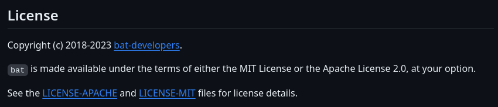
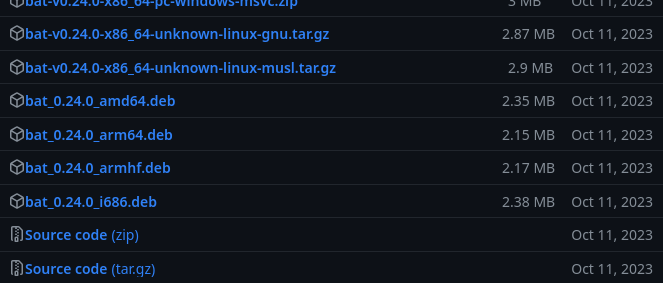

# Packaging bat

[`bat`](https://github.com/sharkdp/bat) is a `cat` clone with extra features
written in Rust (and using the Cargo build system).

_If you want to follow along, run this:_
```
rm -r srcpkgs/bat
```

<!-- toc -->

## Gathering info
To package `bat`, we first need to gather metadata needed in the template. Most
of it is in their repository: <https://github.com/sharkdp/bat>

- latest `version`: `0.24.0` (not `v0.24.0`)
- `build_style`: the Cargo build system is used (this is common for Rust
  projects) so `cargo` is appropriate
- `short_desc`: `Cat(1) clone with syntax highlighting and Git integration`
- `license`: `bat` has two licenses, `Apache-2.0` and `MIT`:

   

   Multiple licenses should be separated by ", " like this:
   ```
   license="Apache-2.0, MIT"
   ```
- `homepage`: project has no custom homepage, <https://github.com/sharkdp/bat>
  is sufficient
- `changelog`: the repo has a `CHANGELOG.md` file, so we should link to it.

   Remember that plaintext changelogs are preferred:

   ~~~admonish failure title="Bad"
  `changelog=https://github.com/sharkdp/bat/blob/master/CHANGELOG.md`
   ~~~

   ~~~admonish success title="Good"
  `changelog=https://raw.githubusercontent.com/sharkdp/bat/master/CHANGELOG.md`
   ~~~

- `distfiles`: `bat`'s release has a lot of files in it:

   

   Prebuilt archives can not be used in
   [`void-packages`](https://github.com/void-linux/void-packages). So you must
   copy the `Source code (tar.gz)` link.

   Don't forget to replace the version with `${version}`:

   ~~~admonish failure title="Bad"
  `https://github.com/sharkdp/bat/archive/refs/tags/v0.24.0.tar.gz`
   ~~~

   ~~~admonish success title="Good"
  `https://github.com/sharkdp/bat/archive/refs/tags/v${version}.tar.gz`
   ~~~

## Creating the template

We can use `xnew` to create the template and fill out what we know:
```bash
# Template file for 'bat'
pkgname=bat
version=0.24.0
revision=1
build_style=cargo
short_desc="Cat(1) clone with syntax highlighting and Git integration"
maintainer="meator <meator.dev@gmail.com>"
license="Apache-2.0, MIT"
homepage="https://github.com/sharkdp/bat"
changelog="https://raw.githubusercontent.com/sharkdp/bat/master/CHANGELOG.md"
distfiles="https://github.com/sharkdp/bat/archive/refs/tags/v${version}.tar.gz"
checksum=badbadbadbadbadbadbadbadbadbadbadbadbadbadbadbadbadbadbadbadbadb
```

We use
```
xgensum -i bat
```
to get `checksum` (`-i` flag modifies the template in place):

```bash
# Template file for 'bat'
pkgname=bat
version=0.24.0
revision=1
build_style=cargo
short_desc="Cat(1) clone with syntax highlighting and Git integration"
maintainer="meator <meator.dev@gmail.com>"
license="Apache-2.0, MIT"
homepage="https://github.com/sharkdp/bat"
changelog="https://raw.githubusercontent.com/sharkdp/bat/master/CHANGELOG.md"
distfiles="https://github.com/sharkdp/bat/archive/refs/tags/v${version}.tar.gz"
checksum=907554a9eff239f256ee8fe05a922aad84febe4fe10a499def72a4557e9eedfb
```

## Testing, troubleshooting & dependency hunting
We can now try to build it:

```
./xbps-src pkg bat
```

The following error arises:

```hidelines=~
{{#include ../../data/bat_error1.txt}}
```

This is a pretty nice error message. It clearly explains that it didn't find
`pkg-config`. `pkg-config` needs to **run** on the **host**, so it belongs to
`hostmakedepends`.

```bash
# Template file for 'bat'
pkgname=bat
version=0.24.0
revision=1
hostmakedepends=pkg-config
build_style=cargo
short_desc="Cat(1) clone with syntax highlighting and Git integration"
maintainer="meator <meator.dev@gmail.com>"
license="Apache-2.0, MIT"
homepage="https://github.com/sharkdp/bat"
changelog="https://raw.githubusercontent.com/sharkdp/bat/master/CHANGELOG.md"
distfiles="https://github.com/sharkdp/bat/archive/refs/tags/v${version}.tar.gz"
checksum=907554a9eff239f256ee8fe05a922aad84febe4fe10a499def72a4557e9eedfb
```

The following error arises:

```hidelines=~
{{#include ../../data/bat_error2.txt}}
```

It's missing the `oniguruma` dependency. It's a library, so it belongs to
`makedepends`.

`bat` needs this library for compilation. It needs header files, pkg-config
files and other stuff that isn't normally included in a library and that is
usually needed only for compilation (which we're doing now). So we need
`oniguruma-devel`.

**Primarily `-devel` packages should appear in `makedepends`.** This is an
important rule of dependency hunting in `xbps-src`.

```bash
# Template file for 'bat'
pkgname=bat
version=0.24.0
revision=1
hostmakedepends=pkg-config
makedepends=oniguruma-devel
build_style=cargo
short_desc="Cat(1) clone with syntax highlighting and Git integration"
maintainer="meator <meator.dev@gmail.com>"
license="Apache-2.0, MIT"
homepage="https://github.com/sharkdp/bat"
changelog="https://raw.githubusercontent.com/sharkdp/bat/master/CHANGELOG.md"
distfiles="https://github.com/sharkdp/bat/archive/refs/tags/v${version}.tar.gz"
checksum=907554a9eff239f256ee8fe05a922aad84febe4fe10a499def72a4557e9eedfb
```

Note: Don't forget to `./xbps-src clean` the masterdir in between failed builds.

We have put `oniguruma-devel` to `hostmakedepends`, but the user also needs the
library in the runtime, it must be in `depends`. But that is not necessary,
because `xbps-src` is smart.

## Shlib dependencies
_This is described in [Packaging oniguruma](packaging-oniguruma.md) in detail._

To compile the `bat` package which depends on library `oniguruma`, `bat` must
have `oniguruma-devel` in its `hostmakedepends`. But `oniguruma` must be
installed alongside `bat` for `bat` to work, because `oniguruma` provides
dynamic libraries `bat` needs.

When a program is linked against a static library, the program "remembers" which
library it has been linked to. It marks the SONAME of the library in the
executable. The details of this process are beyond the scope of this tutorial.

`xbps-src` reads the SONAMEs of the executables and libraries in `$DESTDIR`. It
can detect runtime dependencies (like `oniguruma`) based on this information.

This means that you don't usually have to specify libraries in `depends`. Only
"external" runtime dependencies like some other programs are usually specified
there.

```admonish warning
Interpreted programming languages like Python can not have shlib dependency
detection due to the way they work. You have to specify all `depends`
dependencies for them. This is further described later in [packaging
rofimoji](packaging-rofimoji.md#dependencies-for-interpreted-packages).
```

### Some progress
The template works. But it could be improved.

`xlint` returns this:

```
bat:6: Place makedepends= after build_style=
bat:10: license 'MIT', but no use of vlicense
```

The first warning is easy to fix, the second one requires some explanation:

## Installing licenses
Some licenses (namely `AGPL`, `MIT`, `BSD`, `ISC`, `X11`, and custom licenses)
require the license to be installed alongside the program to make user aware of
it.

Licenses are installed in `/usr/share/licenses`. `xbps-src` includes a helper
function called `vlicense` that install the file it is supplied with to
`usr/share/licenses/<pkgname>`. This is what the `xlint` warning is referring
to. It is usually called in `post_install()`

```bash
# Template file for 'bat'
pkgname=bat
version=0.24.0
revision=1
build_style=cargo
hostmakedepends=pkg-config
makedepends=oniguruma-devel
short_desc="Cat(1) clone with syntax highlighting and Git integration"
maintainer="meator <meator.dev@gmail.com>"
license="Apache-2.0, MIT"
homepage="https://github.com/sharkdp/bat"
changelog="https://raw.githubusercontent.com/sharkdp/bat/master/CHANGELOG.md"
distfiles="https://github.com/sharkdp/bat/archive/refs/tags/v${version}.tar.gz"
checksum=907554a9eff239f256ee8fe05a922aad84febe4fe10a499def72a4557e9eedfb

post_install() {
	vlicense LICENSE-MIT
}
```

## Installing supplementary files
Some projects include useful data files like man pages and shell completions.
Their build system might not install them, they may have to be installed
manually.

Since they are data files and they do not have to be compiled, installing them
is very simple. They just have to be copied to `$DESTDIR`.

`bat` provides a manpage, but it is generated during the build process[^batspecific]. It get's
put into

```
masterdir-x86_64/builddir/bat-0.24.0/target/x86_64-unknown-linux-gnu/release/build/bat-4df82ff77e13ab15/out/assets/manual/bat.1
```

on my computer which is impractical. The directory name is very long and it
contains a UID (here `4df82ff77e13ab15`).

If you inspect `bat`'s build system closely, you might stumble upon [pull
request #2515](https://github.com/sharkdp/bat/pull/2515)[^tranzystorekk] and
[`BAT_ASSETS_GEN_DIR` detection code in `bat's` build
system](https://github.com/sharkdp/bat/blob/master/build/application.rs#L30).
This shows us that `bat` provides a way to override the directory by setting the
`BAT_ASSETS_GEN_DIR` environmental variable.

But how would you set an environmental variable in a template? The template is
"just a bash script", so the correct way is using `export`:

```bash
# Template file for 'bat'
pkgname=bat
version=0.24.0
revision=1
build_style=cargo
hostmakedepends=pkg-config
makedepends=oniguruma-devel
short_desc="Cat(1) clone with syntax highlighting and Git integration"
maintainer="meator <meator.dev@gmail.com>"
license="Apache-2.0, MIT"
homepage="https://github.com/sharkdp/bat"
changelog="https://raw.githubusercontent.com/sharkdp/bat/master/CHANGELOG.md"
distfiles="https://github.com/sharkdp/bat/archive/refs/tags/v${version}.tar.gz"
checksum=907554a9eff239f256ee8fe05a922aad84febe4fe10a499def72a4557e9eedfb

export BAT_ASSETS_GEN_DIR="${XBPS_BUILDDIR}/${pkgname}-${version}"

post_install() {
	vlicense LICENSE-MIT
}
```

[This is an useful trick by the way.](../tips_and_tricks.md#setting-environmental-variables)

`BAT_ASSETS_GEN_DIR` uses `XBPS_BUILDDIR`, `pkgname` and `version` variables.
`pkgname` and `version` are defined in the template and `XBPS_BUILDDIR` is an
useful variable (one of many) provided by `xbps-src`. See the
[Manual](https://github.com/void-linux/void-packages/blob/master/Manual.md#global-variables)
for more info.

The manpage will now be in `assets/manual/bat.1` (relative to `$wrksrc`) which
is much more practical. You can now install it like this:

```bash
# Template file for 'bat'
pkgname=bat
version=0.24.0
revision=1
build_style=cargo
hostmakedepends=pkg-config
makedepends=oniguruma-devel
short_desc="Cat(1) clone with syntax highlighting and Git integration"
maintainer="meator <meator.dev@gmail.com>"
license="Apache-2.0, MIT"
homepage="https://github.com/sharkdp/bat"
changelog="https://raw.githubusercontent.com/sharkdp/bat/master/CHANGELOG.md"
distfiles="https://github.com/sharkdp/bat/archive/refs/tags/v${version}.tar.gz"
checksum=907554a9eff239f256ee8fe05a922aad84febe4fe10a499def72a4557e9eedfb

export BAT_ASSETS_GEN_DIR="${XBPS_BUILDDIR}/${pkgname}-${version}"

post_install() {
	vlicense LICENSE-MIT
	mv assets/manual/bat.1 $DESTDIR/usr/share/man/man1
}
```

But installing manpages is a common operation, so `xbps-src` provides a helper
for it. There are several helpers for installing
things. They include `vman`, `vdoc`, `vconf`, `vlicense` (used above) and
`vcompletion`. You can read more [in the
Manual](https://github.com/void-linux/void-packages/blob/master/Manual.md#global-functions).

Here's the template with `vman`:
```bash
# Template file for 'bat'
pkgname=bat
version=0.24.0
revision=1
build_style=cargo
hostmakedepends=pkg-config
makedepends=oniguruma-devel
short_desc="Cat(1) clone with syntax highlighting and Git integration"
maintainer="meator <meator.dev@gmail.com>"
license="Apache-2.0, MIT"
homepage="https://github.com/sharkdp/bat"
changelog="https://raw.githubusercontent.com/sharkdp/bat/master/CHANGELOG.md"
distfiles="https://github.com/sharkdp/bat/archive/refs/tags/v${version}.tar.gz"
checksum=907554a9eff239f256ee8fe05a922aad84febe4fe10a499def72a4557e9eedfb

export BAT_ASSETS_GEN_DIR="${XBPS_BUILDDIR}/${pkgname}-${version}"

post_install() {
	vlicense LICENSE-MIT
	vman assets/manual/bat.1
}
```

`bat` also provides shell completions. They are generated too, but the path has
been fixed already, so they'll end up in `assets/completions/bat.fish`,
`assets/completions/bat.zsh` and `assets/completions/bat.bash`. Now that you
know that `xbps-src` has helpers for this, you don't even have to know where
these should be installed.

The `vcompletion` helper requires the type of completion script as the second
argument. This is best presented in practise:

```bash
# Template file for 'bat'
pkgname=bat
version=0.24.0
revision=1
build_style=cargo
hostmakedepends=pkg-config
makedepends=oniguruma-devel
short_desc="Cat(1) clone with syntax highlighting and Git integration"
maintainer="meator <meator.dev@gmail.com>"
license="Apache-2.0, MIT"
homepage="https://github.com/sharkdp/bat"
changelog="https://raw.githubusercontent.com/sharkdp/bat/master/CHANGELOG.md"
distfiles="https://github.com/sharkdp/bat/archive/refs/tags/v${version}.tar.gz"
checksum=907554a9eff239f256ee8fe05a922aad84febe4fe10a499def72a4557e9eedfb

export BAT_ASSETS_GEN_DIR="${XBPS_BUILDDIR}/${pkgname}-${version}"

post_install() {
	vlicense LICENSE-MIT
	vman assets/manual/bat.1
	vcompletion assets/completions/bat.fish fish
	vcompletion assets/completions/bat.zsh zsh
	vcompletion assets/completions/bat.bash bash
}
```

## Comparing with upstream template
This is our template:
```bash
# Template file for 'bat'
pkgname=bat
version=0.24.0
revision=1
build_style=cargo
hostmakedepends=pkg-config
makedepends=oniguruma-devel
short_desc="Cat(1) clone with syntax highlighting and Git integration"
maintainer="meator <meator.dev@gmail.com>"
license="Apache-2.0, MIT"
homepage="https://github.com/sharkdp/bat"
changelog="https://raw.githubusercontent.com/sharkdp/bat/master/CHANGELOG.md"
distfiles="https://github.com/sharkdp/bat/archive/refs/tags/v${version}.tar.gz"
checksum=907554a9eff239f256ee8fe05a922aad84febe4fe10a499def72a4557e9eedfb

export BAT_ASSETS_GEN_DIR="${XBPS_BUILDDIR}/${pkgname}-${version}"

post_install() {
	vlicense LICENSE-MIT
	vman assets/manual/bat.1
	vcompletion assets/completions/bat.fish fish
	vcompletion assets/completions/bat.zsh zsh
	vcompletion assets/completions/bat.bash bash
}
```

This is the upstream template (at the time of writing this article):
```bash
# Template file for 'bat'
pkgname=bat
version=0.24.0
revision=1
build_style=cargo
hostmakedepends="pkg-config"
makedepends="libgit2-devel oniguruma-devel"
short_desc="Cat(1) clone with syntax highlighting and Git integration"
maintainer="John <me@johnnynator.dev>"
license="Apache-2.0, MIT"
homepage="https://github.com/sharkdp/bat"
changelog="https://raw.githubusercontent.com/sharkdp/bat/master/CHANGELOG.md"
distfiles="https://github.com/sharkdp/bat/archive/refs/tags/v${version}.tar.gz"
checksum=907554a9eff239f256ee8fe05a922aad84febe4fe10a499def72a4557e9eedfb

export BAT_ASSETS_GEN_DIR="${XBPS_BUILDDIR}/${pkgname}-${version}"

post_patch() {
	cargo update --package git2@0.18.0 --precise 0.17.2
}

post_install() {
	vlicense LICENSE-MIT
	vdoc README.md
	vman assets/manual/bat.1
	vcompletion assets/completions/bat.fish fish
	vcompletion assets/completions/bat.zsh zsh
	vcompletion assets/completions/bat.bash bash
}
```

with the following patch:
```patch
{{#include ../../data/downgrade-git2.patch}}
```

The templates are similar, which is good. The official one tries to override a
`libgit2` dependency with the packaged `libgit2-devel`. Our template just pulls
this dependency with the rest.

It also includes a patch to make the XBPS version of `libgit2` work in `bat`.

## What now?
You might be wondering how the SHLIB detection works. This is best explained
while packaging a library. The next part of this tutorial packages
[`oniguruma`](https://github.com/kkos/oniguruma), a dependency of `bat`:

[Packaging oniguruma](packaging-oniguruma.md)

---

[^batspecific]: This is a `bat` specific thing. Other projects might have their
                data files in the repository without need of generation. The
                packaging process is the same, you just `vman` or `vcompletion`
                the files.
[^tranzystorekk]: This pull request was made by
                  [tranzystorekk](https://github.com/tranzystorekk), a Void
                  Linux contributor at the time of writing this tutorial. It's
                  nice to see a fellow Voider improving the projects they're
                  packaging. You should take inspiration from this if you have
                  the know how (and if upstream needs fixing).
